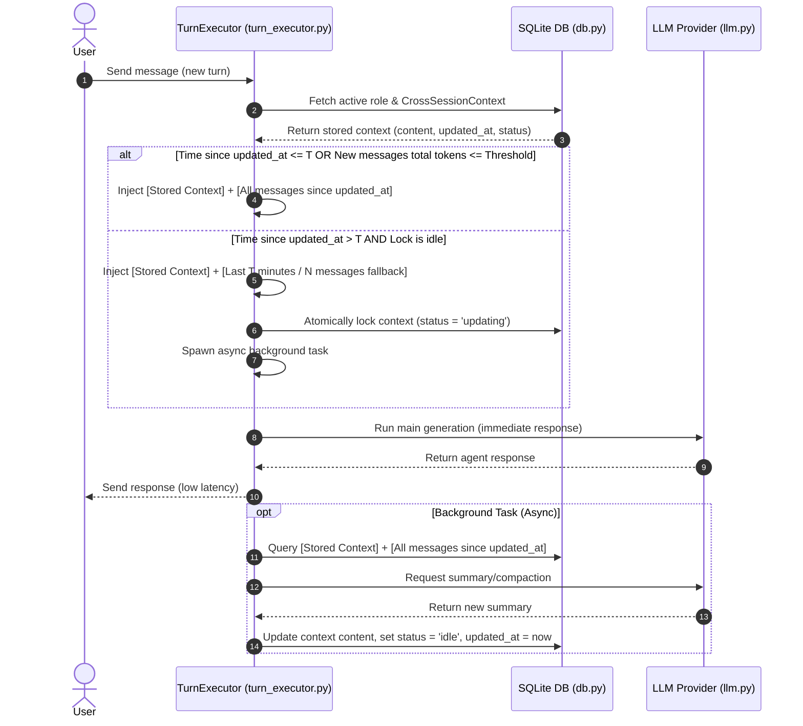

# Cross-Session Context Design

This document details the design and implementation plan for a robust, lock-guarded, token-adaptive `CrossSessionContext` storage and background refresh mechanism for the Kesoku AI Agent.

---

## 1. Architecture Overview

The `CrossSessionContext` mechanism manages agent working memory across different sessions belonging to the same role/persona. The architecture ensures high coherence, low latency, and safety against concurrent summarization calls.



---

## 2. Database Layer Changes (`src/kesoku/db/`)

### 2.1 Schema Definition
A new table `cross_session_contexts` will store the synchronized context state per role.

```sql
CREATE TABLE IF NOT EXISTS cross_session_contexts (
    role TEXT PRIMARY KEY,
    content TEXT NOT NULL,
    updated_at REAL NOT NULL,
    status TEXT NOT NULL DEFAULT 'idle' -- 'idle' or 'updating'
);
```

### 2.2 Code Additions
1. **Pydantic Model**:
   ```python
   class CrossSessionContext(BaseModel):
       role: str
       content: str
       updated_at: float
       status: str = "idle"
   ```
2. **Database Helper Methods**:
   - `get_cross_session_context(role: str) -> CrossSessionContext | None`: Retrieves the context for a specific role.
   - `upsert_cross_session_context(role: str, content: str) -> None`: Inserts or updates the content (for initialization).
   - `claim_cross_session_context_for_update(role: str) -> bool`: Atomically claims the lock. Uses a CAS query. If a lock is `'updating'` but older than 5 minutes (300 seconds), it forcibly resets and claims it to prevent deadlocks.
     ```python
     def claim_cross_session_context_for_update(self, role: str) -> bool:
         conn = self._get_connection()
         try:
             with conn:
                 now = time.time()
                 # 1. Self-heal any stale locks (> 300s) for this role first
                 conn.execute(
                     """
                     UPDATE cross_session_contexts
                     SET status = 'idle'
                     WHERE role = ? AND status = 'updating' AND (? - updated_at) > 300
                     """,
                     (role, now),
                 )
                 # 2. Atomically claim lock
                 cursor = conn.execute(
                     """
                     UPDATE cross_session_contexts
                     SET status = 'updating', updated_at = ?
                     WHERE role = ? AND status = 'idle'
                     """,
                     (now, role),
                 )
                 return cursor.rowcount == 1
         finally:
             conn.close()
     ```
   - `release_cross_session_context_lock(role: str, content: str) -> None`: Updates the content, sets `updated_at` to the current timestamp, and resets status to `idle`.
   - `recover_orphaned_context_locks() -> int`: Executed on startup to clean up any lingering `'updating'` locks from a sudden service crash.
     ```python
     def recover_orphaned_context_locks(self) -> int:
         conn = self._get_connection()
         try:
             with conn:
                 cursor = conn.execute(
                     "UPDATE cross_session_contexts SET status = 'idle' WHERE status = 'updating'"
                 )
                 return cursor.rowcount
         finally:
             conn.close()
     ```

---

## 3. Turn Executor Layer Changes (`src/kesoku/agent/turn_executor.py`)

### 3.1 Injection Logic in `process_turn`
The context injection will run immediately before system prompts are constructed:

1. **Retrieve Context**: Fetch the current `CrossSessionContext` for the active role (defaulting to an empty context if none exists).
2. **Calculate Messages Since Update (Excluding Current Session & Low-Value Messages)**: Fetch messages whose timestamps are greater than `updated_at`, **excluding those belonging to the active `session_id`**, and **strictly filter for high-value messages** (`role = 'user'` or `role = 'assistant'` with `type = 'text'`). Exclude raw tool calls, tool results, and internal thoughts to prevent massive token waste and context pollution.
3. **Estimate/Count Tokens**: Count the tokens of these high-value, non-current-session newer messages.
4. **Evaluate Timeout & Threshold**:
   - **Case A (Not Timed Out or Under Threshold)**:
     If `now - updated_at <= 30 minutes` OR `tokens(new_messages) <= 4000`:
     - Inject `[Stored Context]` + `[All messages since updated_at belonging to other sessions]`.
   - **Case B (Timed Out & Lock Idle - Triggers Summarization)**:
     If `now - updated_at > 30 minutes` AND `tokens(new_messages) > 4000`:
     - Inject `[Stored Context]` + `[All non-current-session messages in the last 30 minutes (or last N turns)]`.
     - Attempt to claim the lock via `claim_cross_session_context_for_update(active_role)`.
     - If lock is claimed successfully, spawn the background task (note: the background task **must** include the current session's history to ensure its progress is compiled into the persistent memory):
       ```python
       asyncio.create_task(
           self._summarize_cross_session_context_bg(
               active_role, stored_context.content, updated_at
           )
       )
       ```
5. **Inject Suffix**: Format and append the context block to the end of the latest user message in the history array.

---

## 4. Background Summarization Task

A dedicated helper method in `TurnExecutor` will execute the async LLM call in the background:

```python
async def _summarize_cross_session_context_bg(
    self, role: str, current_context: str, since_timestamp: float
) -> None:
    """Runs an asynchronous background task to summarize the context."""
    try:
        # 1. Fetch all messages since since_timestamp for this role
        history_msgs = await self.gateway.get_role_messages_since(role, since_timestamp)
        
        # 2. Build prompt for summarization
        prompt = (
            f"You are a background memory consolidator.\n"
            f"Current Stored Memory:\n\"\"\"\n{current_context}\n\"\"\"\n\n"
            f"New Conversation history since last update:\n\"\"\"\n"
            + "\n".join(f"{m.role}: {m.content}" for m in history_msgs)
            + "\n\"\"\"\n\n"
            f"Combine the current memory and the new conversation history into a single, consolidated, concise summary.\n"
            f"Rules:\n"
            f"- Retain current high-priority tasks, active workspace paths, and major decisions.\n"
            f"- Drop minor chit-chat and temporary variables.\n"
            f"- Maintain a highly factual, bullet-pointed structure."
        )
        
        # 3. Invoke LLM
        llm = self.context.get_llm()
        res = await llm.generate(system_prompt="You are a memory consolidator.", prompt=prompt)
        new_summary = res.content
        
        # 4. Save to DB and release lock
        await asyncio.to_thread(
            self.gateway.db.release_cross_session_context_lock,
            role,
            new_summary
        )
        logger.info(f"Successfully consolidated CrossSessionContext for role '{role}' in background.")
    except Exception as e:
        logger.error(f"Failed to summarize CrossSessionContext for role '{role}': {e}", exc_info=True)
        # Ensure lock is released on failure
        await asyncio.to_thread(
            self.gateway.db.db_manager_fallback_release_lock_only, role
        )
```

---

## 5. Testing & Verification Plan

To verify this implementation, we will implement both Unit Tests and Integration Tests.

### 5.1 Unit Tests (`tests/test_cross_session_context.py`)
- **DB Operations**: Test `upsert`, `claim_lock` (returns False if already locked), and `release_lock` updates.
- **Token-Adaptive Injection**: Mock messages of varying lengths and verify that Case A (inject all) and Case B (fallback sliding window) are correctly triggered under different conditions.
- **Background Lock Execution**: Verify that only one asyncio background task is triggered for concurrent requests.

### 5.2 Integration Tests
- Set a low timeout (e.g., $T = 5$ seconds) in a test environment.
- Simulate a conversation session. Send several messages, wait 6 seconds, then send another message.
- Verify that the main message is responded to immediately, and subsequent database lookups show that the background task has successfully updated the context without stalling the response.
- Run `uv run ruff check` to ensure compliance with coding rules.
