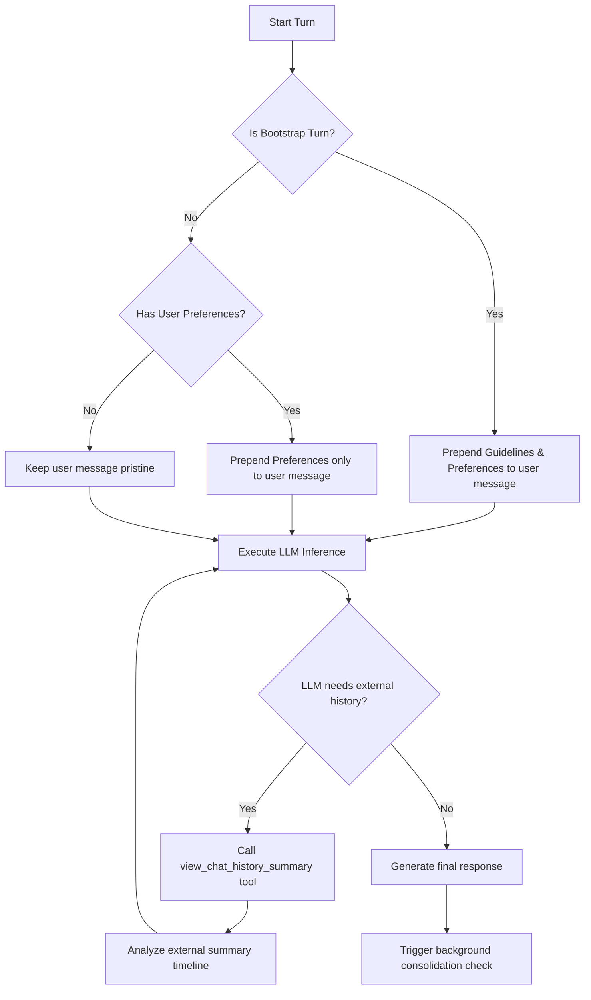

# Kesoku Memory & Context Injection System Design (v2)

## 1. Executive Summary

This document details the production architecture of the **Kesoku Memory System (v2)**. It addresses the critical "Attention Distraction" and "Context Drift" vulnerabilities identified in passive full-injection memory architectures (v1). 

By combining **Unconditional Preferences Injection** (always injecting active user preferences to ensure consistent instruction adherence) and **Bootstrap-Triggered Guidelines Injection** (injecting passive sync guidelines only on session start or idle resumption) with **On-Demand Pull Retrieval** (wrapping cross-session timelines into a dedicated LLM Tool), Kesoku v2 achieves an optimal balance of developer-level execution focus, token efficiency, and cross-channel smart awareness.

---

## 2. Core Architecture Overview

The memory system decouples static metadata, rule-based user profiles, and volatile conversational timelines into distinct layers. The underlying storage continues to utilize **SQLite** (`kesoku.db`) for atomic transactional safety.

```
+-----------------------------------------------------------------------------+
|                               SQLite Database                               |
+-----------------------------------------------------------------------------+
       |                                                               |
       v                                                               v
+-----------------------+                               +---------------------+
|   `agent_memories`    |                               |`cross_session_ctx`  |
|    (Structured KV)    |                               |  (Event Timeline)   |
+-----------------------+                               +---------------------+
       |                                                               |
       | (Passive Push)                                                | (Active Pull)
       v                                                               v
+-----------------------+                               +---------------------+
|   Bootstrap Injection |                               |   Tool API Call     |
| (Only on New/Resume)  |                               |`view_cross_session_`|
|                       |                               |`memory`             |
+-----------------------+                               +---------------------+
       |                                                               |
       +-------------------------------+-------------------------------+
                                       |
                                       v
                    +-------------------------------------+
                    |           LLM Context               |
                    |    (Clean & Focused Execution)      |
                    +-------------------------------------+
```

### 2.1 Session Turn Execution Flow



---

## 3. Storage Layer Specifications

Structured data partitioning ensures that user preferences stay isolated per persona role, while project progresses and lessons learned are globally shared.

### 3.1 Structured memories (`agent_memories`)
```sql
CREATE TABLE IF NOT EXISTS agent_memories (
    id INTEGER PRIMARY KEY AUTOINCREMENT,
    category TEXT NOT NULL,         -- 'user_preferences', 'progress', 'learnings'
    key TEXT NOT NULL,              -- Sanitized snake_case (regex: ^[a-z0-9_]+$)
    title TEXT NOT NULL,            -- Short label or title
    content TEXT NOT NULL,          -- Markdown or JSON (maximum length: 500 chars)
    updated_at REAL NOT NULL,       -- UNIX epoch float
    role TEXT NOT NULL DEFAULT 'default', -- Active persona scope
    UNIQUE(category, key, role)     -- Safe UPSERT constraint
);
```

### 3.2 Narrative Timelines (`cross_session_contexts`)
Contains the consolidated chronological milestone narrative per persona, updated asynchronously.
```sql
CREATE TABLE IF NOT EXISTS cross_session_contexts (
    role TEXT PRIMARY KEY,          -- Active roleplay persona key
    content TEXT NOT NULL,          -- Compiled narrative timeline
    updated_at REAL NOT NULL,       -- Checkpoint timestamp
    status TEXT NOT NULL DEFAULT 'idle' -- Lock state ('idle', 'locked')
);
```

---

## 4. Dynamic Context Injection

To protect the LLM's attention span during active conversation turns, **Cross-Session Memory is never passively injected into regular dialog turns**. 

Instead, Kesoku employs a hybrid injection strategy: **Sync Guidelines** are injected only on Bootstrap Turns (new session or idle resumption), whereas **User Preferences** are injected unconditionally on every turn (if they exist).

### 4.1 Injection Conditions
- **Sync Guidelines**: Injected on **Bootstrap Turns** only. A turn is flagged as a `Bootstrap Turn` if and only if:
  1.  **New Session**: The turn count in the current session is `0` or `1`.
  2.  **Idle Session Resumption**: The idle duration (current message timestamp minus the timestamp of the last session message) exceeds the **Idle Threshold** (default: `1800` seconds / 30 minutes).
- **User Preferences**: Injected **on every turn** (unconditional), provided that the user has defined preferences in the database.

### 4.2 Injection Templates

#### Case A: Bootstrap Turn (With User Preferences)
Both Guidelines and Preferences are injected:
```markdown
[Background Context: Sync Guidelines]
======
# Passive Synchronization Guidelines:
- 💡 You are playing the active persona role: {active_role}.
- 💡 You have access to the `view_chat_history_summary` tool, which retrieves a consolidated chat history summary and chronological timeline of recent events across active threads/channels.
- 💡 If the user's current request below refers to external threads, other chats, or events you cannot locate in this session's history, you MUST call `view_chat_history_summary` to read the global context and synchronize before providing a response.
======

[User Preferences]
- Preferred Programming Language: Python
- Code Style: PEP 8 compliant, explicit type hints
- Preferred Test Framework: pytest with uv run

[Current Request]
{original_user_message_content}
```

#### Case B: Non-Bootstrap Turn (With User Preferences)
Only Preferences are injected:
```markdown
[User Preferences]
- Preferred Programming Language: Python
- Code Style: PEP 8 compliant, explicit type hints
- Preferred Test Framework: pytest with uv run

[Current Request]
{original_user_message_content}
```

#### Case C: Non-Bootstrap Turn (Without User Preferences)
No injection occurs; the user message remains pristine.

---

## 5. On-Demand Memory Pull Tool

When the LLM receives a request that implies external dependencies, it utilizes the dedicated Pull tool to synchronize its knowledge.

### 5.1 The `view_chat_history_summary` Tool
*   **Signature**: `view_chat_history_summary(context: ToolContext)`
*   **Execution Flow**:
    1.  Resolves the current active persona role.
    2.  Queries the `cross_session_contexts` table for the role's narrative timeline.
    3.  Queries `get_role_messages_since` in the `messages` table to fetch any recent active messages written *after* the last consolidation checkpoint (`updated_at`), ensuring real-time updates are not missed.
    4.  Outputs a consolidated Markdown text block combining both the consolidated summary timeline and recent active messages.

### 5.2 Concrete Execution Example (The "Pull" Turn)

1.  **User Request**: "刚才在 Discord 里讨论的那个并发 bug，ConnectionProvider 的测试用例你写完了吗？"
2.  **LLM Turn Boot**: Because this is a new/idle turn, the **Bootstrap Injection** template is prepended. The LLM sees it has access to the `view_chat_history_summary` tool to read global context.
3.  **LLM Analysis**: The LLM analyzes the request and realizes it does not have "Discord并发bug" or "ConnectionProvider" in its current local history, but it's told it has a tool to read the global chat history summary.
4.  **Tool Call**:
    ```json
    {
      "name": "view_chat_history_summary",
      "arguments": {}
    }
    ```
5.  **Tool Output**:
    ```markdown
    === Consolidated Chat History Summary (Role: default) ===
    - [05-30 18:20] User initiated a refactor of DatabaseManager connection pool on Discord.
    - [05-30 19:05] Discussed ConnectionProvider to isolate SQLite handle management.
    - [05-31 10:30] Encountered concurrency thread-safety failures in tests. Resolved via connection check-in hooks.
    ```
6.  **Assistant Response**: "写完了！Discord 上讨论在大数据库重构 bug 已经通过引入连接签入钩子（check-in hooks）得到了解决。需要我为您展示编写好的测试用例代码吗？"

---

## 6. Background Consolidation Engine (Unchanged)

The background pipeline responsible for keeping the `cross_session_contexts` database record consolidated operates independently of the injection cycle:

1.  **Trigger Check**: When a turn finishes, the system calculates the total tokens of new cross-session messages since the last checkpoint (`updated_at`).
2.  **Consolidation Threshold**: If new messages exceed `4000` tokens OR the age of the last checkpoint is > `1800` seconds, consolidation is required.
3.  **Lock Claim**: Atomically updates `status = 'locked'` for the role.
4.  **Background Execution**: Spawns a background thread/task running `_summarize_cross_session_context_bg`. It uses a specialized LLM prompt to merge the timeline and new chats into a clean, chronological Markdown bullet list under `300` words, stripping trivial greetings, user profiles, and system rules.
5.  **Release Lock**: Saves the new content, sets `updated_at = checkpoint_timestamp`, and reverts `status = 'idle'`.
