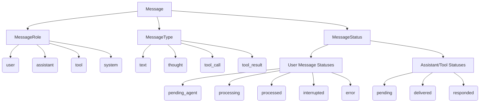

# Kesoku AI Agent: Message Data Model & Lifecycle Specification

This document provides a comprehensive specification of the `Message` data model, field configuration matrices, system-wide lifecycles, history storage rules, user visibility behaviors, and end-to-end conversational trajectories within the Kesoku AI Agent framework.

---

## 1. Core Architecture Overview

Kesoku operates on a highly decoupled, asynchronous **Pure Broker Architecture**. At the center of this framework is the `Message` model (defined in [src/kesoku/db.py](file:///usr/local/google/home/chii/Developer/kesoku/src/kesoku/db.py#L20-L43)), persisted locally in SQLite and broadcast across in-memory subscribers via the `Gateway` broker (defined in [src/kesoku/gateway/gateway.py](file:///usr/local/google/home/chii/Developer/kesoku/src/kesoku/gateway/gateway.py)). 

This decoupled approach allows multiple chatbots (e.g., CLI, Discord, Google Chat, WeChat) and backend agent workers to communicate entirely through state-driven messages.

---

## 2. Message Attributes Matrix (The Three Axes)

Every message in Kesoku is structured around three core axes: **Role**, **Type**, and **Status**.



### 2.1 Roles (`role`)
Defines the functional entity responsible for authoring or generating the message.
*   `user`: Sent by the external human user, scheduled background triggers (Cronjobs), or simulated orchestration events.
*   `assistant`: Generated by the Kesoku autonomous AI agent (including internal reasoning thoughts, text responses, or system notification events).
*   `tool`: Encapsulates skill execution requests (tool calls) or skill computation outputs (tool results).
*   `system`: Contains internal orchestration instructions, exception trace notifications, or background followups.

### 2.2 Types (`type`)
Categorizes the operational context or structural format of the message content.
*   `text`: Standard textual dialogue intended for final presentation to the human user or raw ingestion by the LLM.
*   `thought`: Internal reasoning chain-of-thought generated by the assistant *prior* to deciding on tool invocations.
*   `tool_call`: A structured skill execution request specifying the tool name and input parameters.
*   `tool_result`: The raw output (or error/exception stack trace) returned by an executed skill.

### 2.3 Statuses (`status`)
Tracks the operational state of a message through the pipeline.
*   `pending_agent`: A newly ingested user query queued in the database, awaiting pickup by a session worker.
*   `processing`: A user prompt currently being actively evaluated by a background session worker.
*   `processed`: A user query that has been successfully resolved with a final assistant reply.
*   `interrupted`: Message processing that was terminated mid-turn (e.g., because the user sent a newer message mid-turn).
*   `error`: Processing that halted due to a missing session context or unrecoverable execution crash.
*   `pending`: Outgoing assistant reply queued and awaiting delivery by a specific chatbot adapter.
*   `delivered`: Outgoing message successfully printed, broadcasted, or rendered on the target external platform.
*   `responded`: Successfully processed internal message (thoughts, tool calls, tool results, system events) requiring no further chatbot delivery actions.

---

## 3. Detailed Message Field Configuration

The following table documents exactly how field values (`role`, `type`, `chatbot_id`, `channel_id`, `sender`, `status`, `parent_id`, `metadata`) are populated based on the origin and target of the message.

| Message Category | Explanation | `role` | `type` | `chatbot_id` | `channel_id` | `sender` | Initial `status` | Final `status` | User Visibility | LLM (Active Turn) | LLM (Past History) | `metadata` Contents | Example Content |
| :--- | :--- | :--- | :--- | :--- | :--- | :--- | :--- | :--- | :--- | :--- | :--- | :--- | :--- |
| **Standard User Message** | Human user prompt or command input from chat clients | `user` | `text` | Active chatbot (`"cli"`, `"discord"`, etc.) | Platform-specific chat/room ID | User Name | `pending_agent` | `processed`, `interrupted`, or `error` | **Yes** (All channels) | **Yes** (Full content) | **Yes** *(Attachments stripped)* | `{"discord_message_id": str, "attachments": [...]}` | `"What is the weather in Tokyo?"` |
| **Cronjob Trigger Message** | Automated periodic prompt scheduled in background config | `user` | `text` | Chatbot ID | Target channel/room ID | `"Cronjob"` | `pending_agent` | `processed` | **Yes** (All channels) | **Yes** | **Yes** | `{"is_cronjob": True}` | `"Run status diagnostics"` |
| **Manual Compaction Trigger** | Triggered by user running `/compact` command to start compression | `user` | `text` | Chatbot ID | Target channel/room ID | `"System"` | `pending_agent` | `processed` | **Yes** (Trigger channel) | **Yes** | **Yes** | `{"is_compaction": True}` | `"[System Notification] The user manually requested compaction..."` |
| **Assistant Thought** | Internal reasoning / chain-of-thought before running tools | `assistant` | `thought` | Chatbot ID | Target channel/room ID | `"Kesoku"` | `responded` | `responded` *(starts `delivered` on UI bots)* | **Foldable / CLI Only** *(WeChat bypass)* | **Yes** | **No** *(Stripped from completed turns)* | `None` | `"I need to check Tokyo weather using the search tool."` |
| **Assistant Final Text** | Final user-facing text answer generated by the agent | `assistant` | `text` | Chatbot ID | Target channel/room ID | `"Kesoku"` | `pending` | `delivered` | **Yes** (All channels) | **Yes** | **Yes** | `{"turn_metrics": {...}}` | `"The current weather in Tokyo is sunny, 24°C."` |
| **Tool Call Message** | Request generated by model to execute registered tool | `tool` | `tool_call` | Chatbot ID | Target channel/room ID | `"Kesoku"` | `responded` | `responded` *(starts `delivered` on UI bots)* | **Foldable / CLI Only** *(WeChat bypass)* | **Yes** | **Yes** | `{"tool_name": str, "tool_arguments": dict}` | `"Calling tool web_search with args: {'query': 'Tokyo weather'}"` |
| **Tool Result Message** | Execution output or error stack trace returned by tool runner | `tool` | `tool_result` | Chatbot ID | Target channel/room ID | Executed Tool | `responded` | `responded` *(starts `delivered` on UI bots)* | **Foldable / CLI Only** *(WeChat bypass)* | **Yes** | **Yes** | `{"tool_name": str, "tool_result": str}` | `"[STDOUT] Tokyo: Sunny, 24°C ..."` |
| **System Prompt Message** | Master prompt containing framework rules and system instructions | `system` | `text` | `"system"` *(hardcoded)* | `"system"` *(hardcoded)* | `"System"` | `responded` | `responded` | **CLI / UI Only** *(Virtual entry)* | **Yes** *(as System Instruction)* | **Yes** *(as System Instruction)* | `None` | `"# System Instructions\nYou are Kesoku..."` |
| **Background Wakeup Alert** | Alert posted by background job monitor to wake up agent worker | `system` | `text` | Chatbot ID *(resolved from original message)* | Target channel/room ID *(resolved)* | `"System"` | `pending_agent` | `processed` | **No** *(Invisible in background)* | **Yes** *(Mapped to USER turn)* | **Yes** *(Mapped to USER turn)* | `None` | `"[System Alert] Background Job job_123 finished..."` |
| **Nudge Message** | Internal catalyst injected when LLM returns empty response | `system` | `text` | Chatbot ID | Target channel/room ID | `"System"` | `responded` | `responded` | **No** *(Invisible in background)* | **Yes** *(Mapped to USER turn)* | **Yes** *(Mapped to USER turn)* | `None` | `"Your previous response had empty content. Please summarize..."` |
| **User-Facing Notification** | Ephemeral platform notification (e.g., compaction alerts) | `assistant` | `text` | Chatbot ID | Target channel/room ID | `"Notification"` | `pending` | `delivered` | **Yes** *(For platform alert)* | **No** *(Filtered out)* | **No** *(Filtered out)* | `None` | `"🔄 Conversation history has been automatically compacted..."` |
| **System Error Notification** | Error response informing user that unrecoverable crash occurred | `assistant` | `text` | Chatbot ID | Target channel/room ID | `"Kesoku"` | `pending` | `delivered` | **Yes** (All channels) | **Yes** | **Yes** | `None` | `"⚠️ An error occurred while processing your request: ..."` |

### 3.1 Platform-Specific Field Mapping Details

*   **CLI (`cli_bot.py`)**:
    *   `channel_id`: Defaults to `"cli"`.
    *   `sender`: Defaults to `"User"`.
*   **Discord (`discord.py`)**:
    *   `channel_id`: If in a thread or auto-threaded channel, maps to the **Thread ID**; otherwise, maps to the **Channel ID**.
    *   `sender`: Populated with the author's display name (`message.author.display_name`).
    *   `content`: Prefixed with a beautiful formatted header containing the display name, user mention, and local timestamp:
        ```text
        `Username` <@UserID> at `2026-05-27 20:45:00 Asia/Shanghai`:
        [User Prompt Message Content]
        ```
*   **Google Chat (`google_chat.py`)**:
    *   `channel_id`: Maps to the fully qualified thread resource name (e.g., `spaces/AAAAxxxx/threads/YYYY`) or space resource name (e.g., `spaces/AAAAxxxx`).
    *   `sender`: Populated with `displayName` (falling back to `"User"`).
*   **WeChat (`wechat.py`)**:
    *   `channel_id`: Maps to the unique chat ID (e.g., group room ending in `@chatroom` or direct sender ID).
    *   `sender`: Populated with WeChat user ID.
*   **Internal System Messages (`cli_chat.py`, `discord_ui.py`)**:
    *   For **System Prompt Messages** (virtual messages generated locally for UI displays or CLI history runs to show system settings), the system is categorizing them under a separate system scope:
        *   `chatbot_id`: Hardcoded to `"system"`.
        *   `channel_id`: Hardcoded to `"system"`.
        *   `sender`: Hardcoded to `"System"`.
    *   For **Background Wakeup Alerts** (generated when a background shell command task completes execution):
        *   `chatbot_id`: Dynamically resolved from the original initiating message's `chatbot_id`.
        *   `channel_id`: Dynamically resolved from the original initiating message's `channel_id`.
        *   `sender`: Hardcoded to `"System"`.

---

## 4. System-Wide Lifecycle & State Transitions

```
                      [Incoming Human/Cron/Compaction Message]
                                        │
                                        ▼
                             (status: pending_agent)
                                        │
                                        ▼  [Worker picks up turn]
                               (status: processing)
                                        │
        ┌───────────────────────────────┼───────────────────────────────┐
        ▼ (Intermediate Thoughts/Tools)   ▼ (Interruption Triggered)      ▼ (Turn Completed Successfully)
    (status: responded)              (status: interrupted)            (status: processed)
        │                                                               │
        ▼ [Chatbot renders update]                                      ▼ [Final reply posted]
    (status: delivered)                                              (status: pending)
                                                                        │
                                                                        ▼ [Chatbot adapter delivers]
                                                                     (status: delivered)
```

### 4.1 User Query Lifecycle
1.  **Ingestion**: A chatbot adapter captures user text or media, downloads/decrypts attachments to the session staging folder, instantiates a `Message` with `status=MessageStatus.PENDING_AGENT`, and posts it to the gateway.
2.  **Pickup**: The `Agent` dispatcher continuously listens for `PENDING_AGENT` messages. When detected, it checks if there is an active worker for the session. If not, it spins up a `SessionWorker`, claims the message atomically via `claim_message(id, MessageStatus.PROCESSING, [MessageStatus.PENDING_AGENT])`, and runs the execution turn.
3.  **Resolution**:
    *   **Success**: Once the LLM loop completes and posts the final assistant text, the gateway updates the user query status to `MessageStatus.PROCESSED`.
    *   **Interruption**: If a new user message is received on the same channel before the worker finishes, the dispatcher aborts the active worker task and marks both the processing user message and any unfinished tool calls as `MessageStatus.INTERRUPTED`.
    *   **Error**: If an unrecoverable error occurs during execution, the message is marked as `MessageStatus.ERROR`.

### 4.2 Outgoing Assistant Text Lifecycle
1.  **Creation**: The `SessionWorker` posts the final response block (`role=assistant`, `type=text`) with `status=MessageStatus.PENDING`.
2.  **Delivery**: The chatbot adapter (subscribed to `PENDING` messages for its ID) detects it, formats the text for the platform, chunks it according to character limits, transmits files/attachments, and updates the message status to `MessageStatus.DELIVERED` in SQLite.
3.  **Post-Delivery Hook**: Chatbots invoke `on_message_delivered(message)` to cleanly terminate typing indicators, remove ephemeral tool-call status bars, or update the parent thread header with calculated performance metrics.

### 4.3 Intermediate Message Lifecycle (Thoughts & Tools)
1.  **Creation**: When the agent worker decides to think or invoke a tool, it posts a message with `status=MessageStatus.RESPONDED`.
2.  **UI Streaming & Update**:
    *   **Adapters with UI (Discord, Google Chat)**: Listen for `RESPONDED` messages and live-render/update thoughts or tool-call progress indicators (e.g., showing a spinner ⏳). Upon updating the channel, the adapter updates the message status to `MessageStatus.DELIVERED` to prevent double-rendering. When a `tool_result` arrives, the adapter edits the original status in-place to success (✅) or error (❌) emojis.
    *   **Adapters without UI (WeChat)**: Chatbot adapters that do not support inline updating automatically set the status to `MessageStatus.DELIVERED` instantly without presenting thoughts or raw tool calls to the external user.
    *   **CLI (`CLIChatbot`)**: Prints thoughts, tool calls, and outputs immediately in formatted cyan, yellow, and magenta Panels to the terminal, then marks them as `DELIVERED`.

### 4.4 Orphaned/Stuck Message Recovery
*   **Worker Interruption**: If the Kesoku service restarts or crashes while a message is actively `processing`, the message would get stuck. To prevent this, the gateway runs `recover_orphaned_processing_messages()` during startup, identifying any message in `processing` status older than 300 seconds and resetting it back to `MessageStatus.PENDING_AGENT` so the worker can retry it safely.
*   **Tool Call Interruption**: During startup, the history builder runs `get_orphaned_tool_calls()`. If a tool call is found without a matching `tool_result` parent (indicating it was interrupted mid-execution by a service crash), a synthetic result `Message` is injected explaining the interruption so the LLM does not get confused.

---

## 5. History Storage & User Visibility Rules

Kesoku strictly segregates how history is preserved in database storage versus how it is presented to the user and digested by the LLM.

### 5.1 Database History (`get_session_history`)
Every message posted is stored in the SQLite database under the `messages` table. When fetching history:
*   **Full Retention**: All messages (including intermediate thoughts, system errors, and every tool execution) are kept in full.
*   **Logical Sorting (Phased Algorithm)**: Since tool executions run asynchronously and can overlap, sorting messages by simple Unix timestamp can interleave thoughts incorrectly. The database uses **Phased Sorting**, grouping messages into turns and organizing them into clean iteration rounds:
    1.  **Thoughts** (`type=thought`, phase 0)
    2.  **Tool Calls** (`type=tool_call`, phase 1)
    3.  **Tool Results** (`type=tool_result`, phase 2)
    4.  **Final Answers** (`type=text`, phase 3)

### 5.2 LLM Context Prompt History (`build_clean_history`)
When feeding past messages to the Gemini LLM, the history is run through an optimization pipeline:
*   **System Exclusions**: Lightweight system notification messages (e.g., `role=assistant` and `sender="Notification"`) are entirely excluded from the LLM context.
*   **Thought Stripping**: To conserve token context window and prevent Gemini from paying attention to outdated thoughts, **all assistant thoughts (`type=thought`) are stripped from completed historical turns**. Thoughts are strictly preserved *only* in the active/latest turn to guide current action.
*   **Attachment Stripping**: Media files, text files, and images are removed from historical user prompt metadata to save tokens. A placeholder (e.g., `[Attachments stripped from history: data.csv]`) is appended to the text content so the LLM remains aware of the file's presence.
*   **Tool Logs Retention**: Tool calls and tool outputs are kept in their raw form so the model maintains full situational awareness of what commands it ran previously.

### 5.3 User Visibility Matrix
This table specifies whether a message is visible to the human user across different platforms.

| Message Type | CLI | Discord | Google Chat | WeChat |
| :--- | :--- | :--- | :--- | :--- |
| **User Text** | Yes | Yes | Yes | Yes |
| **Assistant Text / File** | Yes (Rich Panel / Line) | Yes (Standard reply) | Yes (Markdown card) | Yes (Normalized plain text) |
| **Assistant Thought** | Yes (Cyan Panel) | Yes (Live status bar update) | Yes (Foldable active turn card) | **No** (Completely hidden) |
| **Tool Call** | Yes (Yellow Panel) | Yes (Live status bar update) | Yes (Foldable active turn card) | **No** (Completely hidden) |
| **Tool Result** | Yes (Magenta Panel) | Yes (Status changes ⏳ ──► ✅) | Yes (Status changes ⏳ ──► ✅) | **No** (Completely hidden) |
| **System Notification** | Yes (Panel / Print) | Yes (Live status bar update) | Yes (Foldable active turn card) | **No** (Completely hidden) |

### 5.4 Advanced Role Mapping & Transpilation Rules

To circumvent the strict alternating role checks (`user` ──► `model` ──► `user`) enforced by modern LLM Chat APIs (such as Google Gemini or OpenAI API) and optimize the flow of automated instructions, Kesoku implements an intelligent translation layer inside the LLM adapter (`history_to_turns` in [src/kesoku/agent/llm.py](file:///usr/local/google/home/chii/Developer/kesoku/src/kesoku/agent/llm.py)):

*   **Nudge Messages (`role=MessageRole.SYSTEM`, `status=MessageStatus.RESPONDED`)**:
    *   *Purpose*: An internal, silent self-healing mechanism used when the LLM returns an empty response mid-turn.
    *   *User Visibility*: Stored as `role=SYSTEM` to keep it completely hidden from the human user across all platform chat windows.
    *   *LLM Transpilation*: The LLM history builder automatically converts any mid-stream `SYSTEM` message into a standard `USER` turn prefixed with `[System Notification]\n`, ensuring the LLM reads it as a fresh instruction without throwing API role alternating violations.
*   **Background Wakeup Alerts (`role=MessageRole.SYSTEM`, `status=MessageStatus.PENDING_AGENT`)**:
    *   *Purpose*: Created by the background process monitor to wake up the agent worker when a background job completes.
    *   *User Visibility*: Hidden from the user to avoid cluttering chat logs with raw command stdout/stderr.
    *   *LLM Transpilation*: Compiled into a standard `USER` block mid-history so the LLM reads the completed job output as a direct instruction.
*   **User-Facing System Notifications (e.g., Compaction Alerts)**:
    *   *Purpose*: Inform the human user that a system action took place (e.g., `🔄 Conversation history has been automatically compacted...`).
    *   *User Visibility*: Saved with `role=MessageRole.ASSISTANT` and `sender="Notification"`, enabling chatbot adapters to broadcast it to external platforms.
    *   *LLM Transpilation*: Completely stripped from the history list fed to the LLM by `build_clean_history` to prevent polluting the model's context window.
*   **Cronjob Trigger Messages**:
    *   *Purpose*: Automated actions triggered by scheduled cron jobs.
    *   *User Visibility*: Visible to the user as a scheduled prompt.
    *   *LLM Transpilation*: Saved under `role=MessageRole.USER` with `sender="Cronjob"` and `metadata={"is_cronjob": True}` to ensure native conversational turn alternation.

---

## 6. Concrete End-to-End Trajectory Examples

Below are concrete sequential traces of `Message` records for three common turn scenarios.

### Example 6.1: Standard User Turn with Tool Execution (Discord)

A user requests: `"Run tests for agent history module"`.

```json
[
  {
    "id": "msg_user_001",
    "session_id": "sess_agent_history",
    "chatbot_id": "discord",
    "channel_id": "1234567890123",
    "sender": "Chii",
    "role": "user",
    "type": "text",
    "content": "`Chii` <@112233> at `2026-05-27 20:50:00 SGT`:\nRun tests for agent history module",
    "status": "pending_agent"
  }
]
```
*(Worker picks up the message ──► `msg_user_001` status changes to `processing`)*

```json
[
  {
    "id": "msg_thought_001",
    "session_id": "sess_agent_history",
    "parent_id": "msg_user_001",
    "chatbot_id": "discord",
    "channel_id": "1234567890123",
    "sender": "Kesoku",
    "role": "assistant",
    "type": "thought",
    "content": "I need to run the unit tests for the history module using uv. I will search for the test file first.",
    "status": "responded"
  },
  {
    "id": "msg_call_001",
    "session_id": "sess_agent_history",
    "parent_id": "msg_user_001",
    "chatbot_id": "discord",
    "channel_id": "1234567890123",
    "sender": "Kesoku",
    "role": "tool",
    "type": "tool_call",
    "content": "Calling tool `run_shell_command` with arguments:\n```json\n{\n  \"command\": \"uv run pytest tests/test_history.py\"\n}\n```",
    "status": "responded",
    "metadata": {
      "tool_name": "run_shell_command",
      "tool_arguments": {
        "command": "uv run pytest tests/test_history.py"
      }
    }
  }
]
```
*(Discord bot live-updates its channel with `💭 I need to run the unit tests...` and `🛠️ run_shell_command: uv run pytest tests/test_history.py ⏳`. Changes status of both messages to `delivered`)*

```json
[
  {
    "id": "msg_result_001",
    "session_id": "sess_agent_history",
    "parent_id": "msg_call_001",
    "chatbot_id": "discord",
    "channel_id": "1234567890123",
    "sender": "run_shell_command",
    "role": "tool",
    "type": "tool_result",
    "content": "=== STDOUT ===\n============================= test session starts =============================\nplugins: anyio-4.3.0\ncollected 5 items\n\ntests/test_history.py .....                                              [100%]\n============================== 5 passed in 0.42s ===============================\n=== STDERR ===\n",
    "status": "responded",
    "metadata": {
      "tool_name": "run_shell_command",
      "tool_result": "5 passed in 0.42s"
    }
  }
]
```
*(Discord bot edits status emoji of `run_shell_command` from ⏳ to ✅ in the status bar, then sets `msg_result_001` status to `delivered`)*

```json
[
  {
    "id": "msg_reply_001",
    "session_id": "sess_agent_history",
    "parent_id": "msg_user_001",
    "chatbot_id": "discord",
    "channel_id": "1234567890123",
    "sender": "Kesoku",
    "role": "assistant",
    "type": "text",
    "content": "I have successfully executed the tests for the agent history module. All 5 tests passed in 0.42 seconds.",
    "status": "pending",
    "metadata": {
      "turn_metrics": {
        "session_turns": 3,
        "context_tokens": 8421,
        "turn_tool_calls": 1,
        "turn_tokens": 1042,
        "turn_time": 2.1
      }
    }
  }
]
```
*(Discord bot sends the final reply, prints metrics to the header view, clears typing state, deletes intermediate status lines, and sets `msg_reply_001` status to `delivered`. The worker sets the original `msg_user_001` to `processed`)*

---

### Example 6.2: Background Cronjob Turn (WeChat)

A background cron triggers a scheduled status check.

```json
[
  {
    "id": "msg_cron_001",
    "session_id": "sess_wechat_status",
    "chatbot_id": "wechat",
    "channel_id": "room123456@chatroom",
    "sender": "Cronjob",
    "role": "user",
    "type": "text",
    "content": "`Cronjob` at `2026-05-27 21:00:00 CST`:\nRun active diagnostics and output status summary.",
    "status": "pending_agent",
    "metadata": {
      "wechat_cronjob": true
    }
  }
]
```
*(Worker claims `msg_cron_001` ──► `status = processing`)*

```json
[
  {
    "id": "msg_cron_thought",
    "session_id": "sess_wechat_status",
    "parent_id": "msg_cron_001",
    "chatbot_id": "wechat",
    "channel_id": "room123456@chatroom",
    "sender": "Kesoku",
    "role": "assistant",
    "type": "thought",
    "content": "WeChat is active. I will run direct system stats and write a concise diagnostic report.",
    "status": "responded"
  }
]
```
*(WeChat bot has no intermediate UI support, so it immediately acknowledges and sets `msg_cron_thought` status to `delivered` in the background, completely hidden from the WeChat chatroom)*

```json
[
  {
    "id": "msg_cron_reply",
    "session_id": "sess_wechat_status",
    "parent_id": "msg_cron_001",
    "chatbot_id": "wechat",
    "channel_id": "room123456@chatroom",
    "sender": "Kesoku",
    "role": "assistant",
    "type": "text",
    "content": "Diagnostics completed successfully. System status is stable. Uptime: 3d 12h, Memory: 45% occupied, 0 active errors reported.",
    "status": "pending"
  }
]
```
*(WeChat bot splits text into Wechat-compliant chunks, delivers the message to the chatroom, and sets `msg_cron_reply` status to `delivered`. Original `msg_cron_001` transitions to `processed`)*

---

### Example 6.3: Thought Interruption

Chii enters a prompt, Gemini begins thinking, but Chii cancels it by sending a newer prompt before Gemini can reply.

1.  Chii enters prompt `"Build a new web component"`.
2.  Message is ingested as `msg_user_a` (`status=pending_agent`), claimed by worker (`status=processing`).
3.  Gemini posts an intermediate thought `msg_thought_a` (`status=responded` ──► `delivered`).
4.  Before the final reply can be generated, Chii types `"Wait, actually build a command line tool instead"`.
5.  The Discord bot captures the new message:
    *   Cancels the active worker's task.
    *   Identifies `msg_user_a` and sets its status to `MessageStatus.INTERRUPTED`.
    *   Deletes `msg_thought_a` and any intermediate indicators from the Discord channel (if Discord).
    *   Posts the new query `msg_user_b` (`status=pending_agent`).
6.  The dispatcher picks up `msg_user_b`, claims it (`status=processing`), and starts the new execution turn cleanly.
