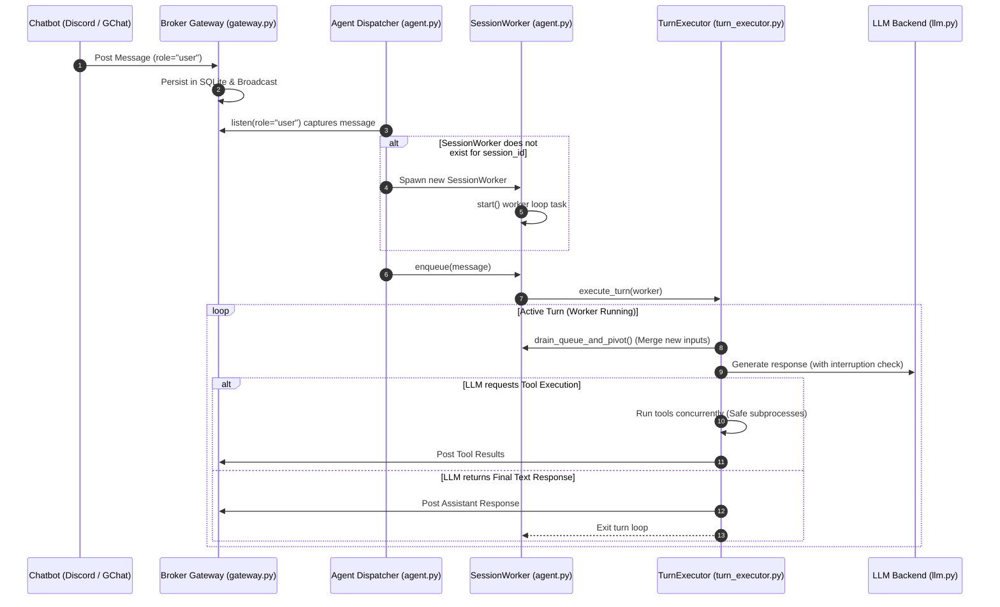

# Agent Loop Cycle (Execution Lifecycle)

This document details the step-by-step lifecycle of a user prompt event as it propagates through Kesoku's asynchronous agent dispatcher and reasoning loops.

---

## 🔄 Lifecycle Diagram

Below is the workflow showing the path of a message from the initial user input to the final assistant response:



---

## ⚙️ 1. Message Ingestion & Gateway Persistence

1.  **Chatbot Ingestion**: An adapter receives a chat message (e.g. a Discord user typing in a thread, or an incoming GCP Pub/Sub pull event).
2.  **Stateless Post**: The adapter resolves the channel/session mappings and calls:
    ```python
    await gateway.post(MessageDTO(role="user", content="...", session_id="...", ...))
    ```
3.  **Persistence**: The Gateway saves the message into the SQLite database (`messages` table) and publishes the event to active in-memory listeners.

---

## 2. Dispatcher Queue Routing (`Agent`)

1.  **Master Loop**: The main `Agent` loop runs a continuous background listener looking for new user messages:
    ```python
    async for msg in self.gateway.listen(role=MessageRole.USER, status=MessageStatus.PENDING):
    ```
2.  **Worker Resolution**: When a message arrives, the dispatcher checks its local dictionary `self.workers` (`dict[str, SessionWorker]`):
    *   If no `SessionWorker` exists for `msg.session_id` (or if the previous worker was terminated), it instantiates a new `SessionWorker`, stores it, and triggers its task loop via `worker.start()`.
3.  **Queue Insertion**: The message is pushed into the worker's internal asynchronous queue (`worker.enqueue(msg)`).

---

## 3. Asynchronous Turn Processing (`SessionWorker`)

1.  **Worker Task**: The `SessionWorker` runs an independent task loop (`_worker_loop`):
    ```python
    async def _worker_loop(self):
        while self.running:
            msg = await self.queue.get()
            # ... resolve active role ...
            await self.executor.execute_turn(message=msg, worker=self)
            self.queue.task_done()
    ```
2.  **Draining and Pivoting**: Inside `execute_turn`, the `TurnExecutor` queries the queue to see if multiple user messages arrived in rapid succession. It drains them and merges them into a single consolidated prompt.
3.  **Agent Reasoning Loop**:
    *   **Context Assembling**: The executor compiles the dynamic system prompt (loading role `intro.md`, AWD path, and staging paths).
    *   **LLM Inference**: The executor issues a non-blocking request to the active LLM backend (`GeminiLLM` or `ClaudeLLM`). It passes an `is_interrupted` callback pointing to `not worker.queue_empty()`. If a user types a new message while the LLM is generating, the generation can be preemptively cancelled.
    *   **Tool Executions**: If the model decides to invoke tools (e.g. `run_shell_command`), the executor runs them.
        *   *Safety Note*: Tool executions are atomic. Once a tool has started running, it will not be killed mid-execution. Interruption checks only happen *between* steps.
4.  **Completion & Hibernation**: Once the LLM returns a final text response (indicating it has finished its turn) and the message queue is empty, the worker task yields and goes to sleep, waiting for the dispatcher to enqueue new events.
