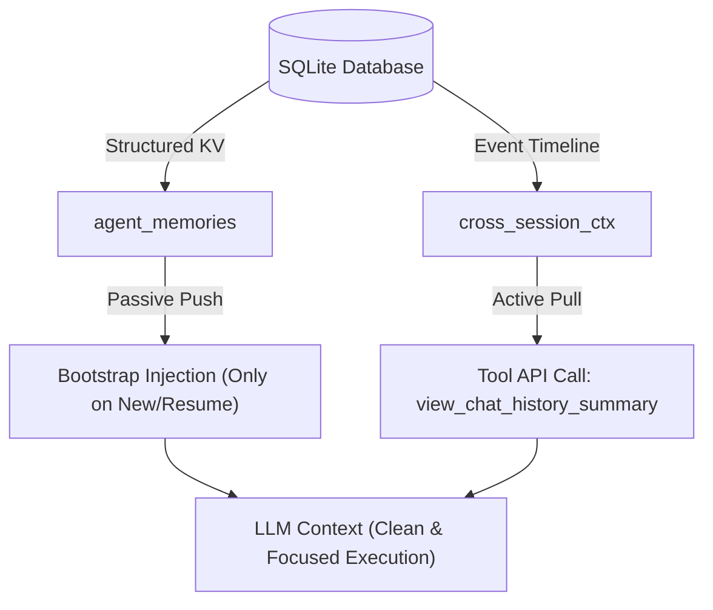

# Memory, Database Design & Lossless Context Management (LCM)

This document outlines the architecture for Kesoku's memory and context management systems. It details the structured SQLite persistence layers, the dynamic prompt injection lifecycle, and how the Local Context Management (LCM) system optimizes long conversation histories without losing context.

---

## 1. Pitfalls of Previous Designs

### 1.1 Flat Markdown Files (`Progress.md`, `Agent.md`)
1. **Full-Overwrite Hazard**: When updating progress for a single project, LLM-generated full-file rewrites are highly prone to "tunnel vision," leading to accidental truncation or deletion of unrelated projects in the same file.
2. **Key Duplication & Drift**: Lacking database constraints, the LLM often creates duplicate, overlapping keys (e.g., `standard_japanese`, `standard_japan`, `标日学习`) for the same entity.
3. **Weak Rule Enforcement**: System rules (such as *"Always run with `uv run`"*) stored in a flat file rely on the LLM proactively loading and reading them, which lacks the enforcement of a hard constraint.

### 1.2 Memory V1 Full Prompt Injection
Bloating the system prompt with everything (preferences, progress, rules) on every turn quickly hits the context window limit and causes **Attention Distraction**—where the LLM ignores crucial rules because it is overwhelmed by irrelevant historical summaries.

---

## 2. Structured Long-Term Memory (SQLite `agent_memories`)

To ensure transactional safety and clean boundaries, Kesoku uses a structured SQLite persistence layer (`agent_memories` table):

```sql
CREATE TABLE IF NOT EXISTS agent_memories (
    id INTEGER PRIMARY KEY AUTOINCREMENT,
    category TEXT NOT NULL,         -- 'progress', 'user_preferences', 'memo'
    key TEXT NOT NULL,              -- unique snake_case identifier (e.g. 'standard_japanese')
    title TEXT NOT NULL,            -- human-readable label
    content TEXT NOT NULL,          -- Markdown or JSON content (max 500 chars)
    updated_at REAL NOT NULL,       -- UNIX timestamp float
    role TEXT NOT NULL DEFAULT 'default', -- active persona scope
    UNIQUE(category, key, role)     -- safe upsert/integrity constraint
);
```

### 2.1 Category Descriptions & Scoping
*   **`progress`**: Used for tracking project work and development milestones. These are **globally shared** across all personas and use the `"default"` role scope.
*   **`user_preferences`**: Stores user details, speech/TTS pronunciation guidelines, personality background, and style preferences. These are **persona-isolated** and bound to the active channel persona.
*   **`memo`**: Custom user-defined notes or memories. These are **persona-isolated**.

### 2.2 Security & Write Lifecycles
*   **User Preferences & Rules**: **Protected (Read-Only for Agent)**. To prevent model hallucinations from fabricating or overwriting preferences, these are only modifiable by the user.
*   **Progress**: **Collaborative (Read-Write for Agent)**. The agent is allowed to write and update these records atomically via tool calls (`INSERT OR REPLACE` mapping), avoiding any overwrite hazards.

---

## 3. Dynamic Prompt Injection Lifecycle

To maximize focus, Kesoku prepends operational memory and preferences to the **latest user message** rather than bloating the global system prompt.

### 3.1 Injection Rules
*   **Bootstrap Turn** (First turn of a session, or idle resumption > 30 minutes):
    *   Prepend **Sync Guidelines** and **User Preferences** to the latest user message.
    *   *Sync Guidelines* inform the LLM that it is active under `role="{active_role}"` and has the `view_chat_history_summary` tool to fetch global timelines if the user refers to external channels.
*   **Regular Turn**:
    *   Prepend **User Preferences** only. Avoids cluttering the prompt with guidelines once the conversation is active.

### 3.2 Injection Template Example
```markdown
[Background Context: Sync Guidelines]
======
# Passive Synchronization Guidelines:
- 💡 You are playing the active persona role: {active_role}.
- 💡 You have access to the `view_chat_history_summary` tool, which retrieves a consolidated chat history summary and chronological timeline of recent events across active threads/channels.
- 💡 If the user's current request below refers to external threads, other chats, or events you cannot locate in this session's history, you MUST call `view_chat_history_summary` to read the global context and synchronize before providing a response.
======

[User Preferences]
- Preferred Programming Language: Python
- Code Style: PEP 8 compliant, explicit type hints
- Preferred Test Framework: pytest with uv run

[Current Request]
{original_user_message}
```

---

## 4. Lossless Context Management (LCM) System

Long conversational threads cannot be kept in their raw transcripts without hitting context limits or causing attention drift. Kesoku integrates the `OpenLCM` engine to compress history while retaining lossless retrieval capabilities.



### 4.1 In-Place Preflight Compaction
1. Before every LLM inference step, the agent checks if the history length exceeds preflight thresholds.
2. If compaction is triggered, the agent converts its message log to standard OpenAI/Anthropic dictionaries and invokes `lcm_engine.compress()`.
3. `OpenLCM` recursively groups oldest turns, summarizes them into hierarchical **Summary Nodes**, and produces a Compacted Summary Timeline DAG.
4. The agent replaces the history with the scaffold summary pointer list, dramatically reducing token counts.

### 4.2 Lossless Retrieval Tools
If the LLM needs to recall details of a compacted section, it can call the following LCM Tools:
*   **`lcm_grep`**: Search raw messages/summaries with keywords and filters (role, timestamps, session scope). Cross-session results are automatically post-filtered to preserve role-isolation.
*   **`lcm_expand`**: Retrieve the full uncompacted text of a specific summary node or message.
*   **`lcm_expand_query`**: Run natural language queries against compacted history, returning a synthesized answer.
*   **`lcm_describe`**: Inspect the hierarchical topology of the memory DAG.
*   **`lcm_status`**: Get current compaction stats and DAG height.

### 4.3 Complementary Coexistence
*   `agent_memories` stores long-term, structured, semantic knowledge and constraints.
*   `OpenLCM` manages short-term, operational conversational history in a token-efficient, lossless manner.
