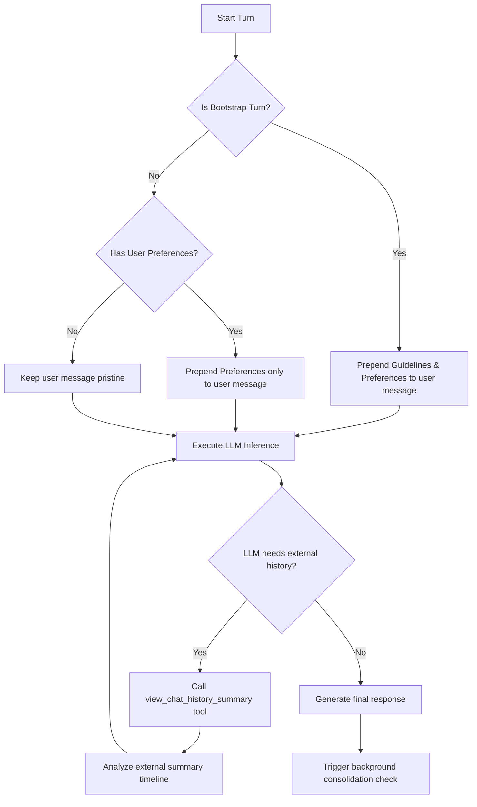
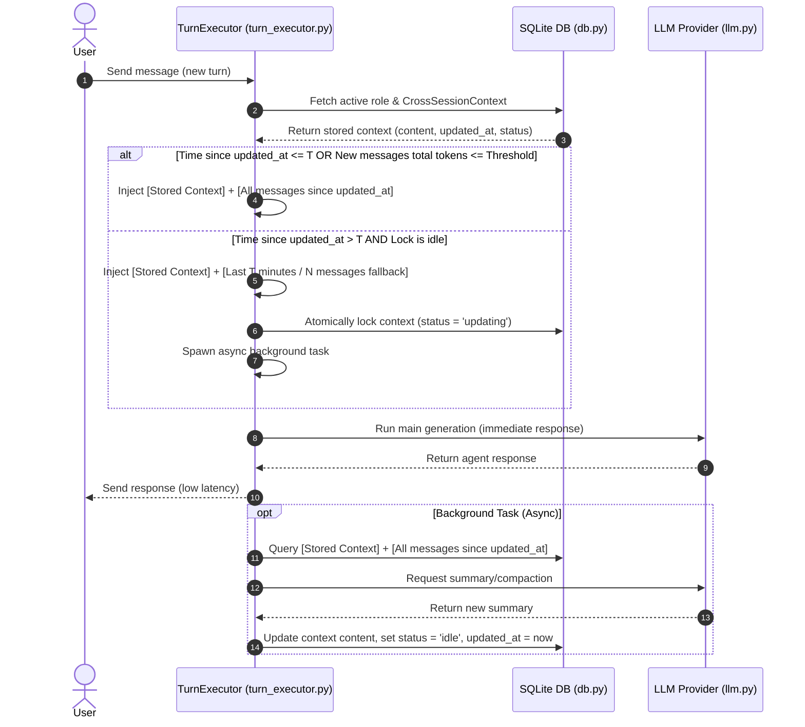

# Memory & Database Design (EN)

## 1. Memory Design v1

# Kesoku Memory System Design

## 1. Executive Summary
This document outlines the architecture for Kesoku's Unified Memory System. It addresses the "Full-Overwrite Hazard" and "Context Drift" common in standard flat-file LLM memory designs (e.g., direct write-back to Markdown files). By decoupling **Structured Storage (SQLite)** from **Semantic Representation (Dynamic Markdown rendering)** and applying **Framework-level System Prompt Injection**, this memory architecture ensures transactional safety, prevents memory fragmentation, and strictly enforces hard runtime rules.

---

## 2. Problem Statement & Design Objectives

### 2.1 Key Vulnerabilities in Flat-File Memory (`Progress.md`, `Agent.md`)
1. **Full-Overwrite Hazard**: When updating progress for a single project, LLM-generated full-file rewrites are highly prone to "tunnel vision," leading to accidental truncation or deletion of unrelated projects in the same file.
2. **Key Duplication & Drift**: Lacking strict database constraints, the LLM often creates duplicate, overlapping keys (e.g., `standard_japanese`, `Standard_Japanese`, `标日学习`) for the same entity.
3. **Weak Rule Enforcement**: Runtime execution rules (such as *"Always run with `uv run`"*) stored in a flat file rely on the LLM's proactive tool calls to read them. This lacks the physical force of a hard constraint.

### 2.2 Core Objectives
- **Transactional Safety**: Key-Value isolation prevents updates on Item A from corrupting Item B.
- **Strict Hard Rules**: Crucial operational rules must be injected directly into the **System Prompt** by the runtime engine, ensuring they are always active.
- **Token Efficiency**: Highly stable, slow-changing records (Profile, Rules) are dynamically injected, while volatile or large records (Progress) are retrieved on-demand via tools to save context window space.

---

## 3. Architecture Overview

The Kesoku Memory System separates memory into three core logical categories stored in a unified SQLite table, but routed differently during the session lifecycle.

```
                  +-----------------------------------+
                  |          SQLite Storage           |
                  |         `agent_memories`          |
                  +-----------------------------------+
                                    |
          +-------------------------+-------------------------+
          | (Category: 'preference')| (Category: 'rule')      | (Category: 'progress')
          v                         v                         v
+-------------------+     +-------------------+     +-------------------------+
|   User Profile    |     |  Execution Rules  |     |   Activity Progress     |
| (Static Facts)    |     | (Hard Constraints)|     |  (Project Tracking)     |
+-------------------+     +-------------------+     +-------------------------+
          |                         |                         |
          v                         v                         | (On-demand tool call)
+---------------------------------------------+               v
|        Framework-level Injection            |     +-------------------------+
|  (Assembled into LLM System Prompt on Boot) |     |  Tool: `view_progress`  |
+---------------------------------------------+     +-------------------------+
```

---

## 4. Data Storage Layer (SQLite Schema)

All structured memories are stored in the `agent_memories` table in `kesoku.db`.

```sql
CREATE TABLE IF NOT EXISTS agent_memories (
    id INTEGER PRIMARY KEY AUTOINCREMENT,
    category TEXT NOT NULL,         -- 'progress', 'preference', 'rule'
    key TEXT NOT NULL,              -- Unified snake_case identifier (e.g. 'standard_japanese')
    title TEXT NOT NULL,            -- Human-readable label (e.g. '《标准日本语》学习进度')
    content TEXT NOT NULL,          -- JSON string or structured payload
    updated_at TIMESTAMP DEFAULT CURRENT_TIMESTAMP,
    UNIQUE(category, key)           -- Enforces atomic overwrite via INSERT OR REPLACE (UPSERT)
);
```

---

## 5. Memory Governance & Lifecycles

Different categories of memory require distinct access privileges and lifecycles:

### 5.1 `preference` (User Profiles & Backgrounds)
- **Privilege**: **Protected (Read-Only for Agent)**.
- **Description**: Contains human traits (timezone, interests, job description).
- **Enforcement**: If the Agent attempts to update a protected key (e.g., `user_profile`), the tool handler rejects the execution to prevent hallucinations from corrupting user-defined profiles. Changes must be manually initiated by the User.

### 5.2 `rule` (Runtime Engineering Safeguards)
- **Privilege**: **Protected (Read-Only for Agent)**.
- **Description**: High-priority constraints (e.g., using `uv run`, outputting to `$STAGING_DIR`, activating role-play skills).
- **Enforcement**: Injected directly into the topmost segment of the System Prompt on session boot.

### 5.3 `progress` (Learning & Project Progress Tracker)
- **Privilege**: **Collaborative (Read-Write for Agent)**.
- **Description**: Current position in books, games, or development milestones.
- **Enforcement**: Written using atomic `INSERT OR REPLACE` operations to safeguard other entries. Retrieved on-demand through tool execution.

---

## 6. Execution Pipeline & Prompt Injection

### 6.1 Lifecycle Boot Sequence
When a new conversational session starts or resumes:
1. **Fetch Dynamic Context**: The Kesoku framework queries the SQLite database:
   ```sql
   SELECT category, key, title, content FROM agent_memories WHERE category IN ('preference', 'rule');
   ```
2. **Translate to Compact Markdown**: The engine renders raw JSON into a highly compact, non-redundant list format:
   ```markdown
   # 1. User Profile & Preferences
   - Name: 小张 (Japanese TTS Pronunciation: "シャオジャン")
   - Current Role: Customer Solutions Engineer at Google Ads
   - Interests: Guitar, Switch Games, Finance

   # 2. Hard Execution Constraints (CRITICAL)
   - ⚠️ You must use 'uv run' to run Python programs. Never use native 'python', 'pip' or 'pytest'.
   - ⚠️ Strictly adhere to the Staging Directory protocol: write all generated files to $STAGING_DIR.
   ```
3. **Prepend to System Prompt**: This rendered string is merged into the LLM `system_instruction` parameter prior to dispatch.

### 6.2 Preventing Key Duplication (Fuzzy Guardrail)
To prevent the LLM from creating redundant keys (e.g., `standard_japanese` and `standard_japan`), the `update_memory` tool implements **Fuzzy Key Matching**:
1. Clean the input key: `lowercase`, strip whitespace, and replace spaces with underscores.
2. Check existing keys under the category using `difflib.get_close_matches` with a threshold of `0.8`.
3. If an existing key matches, redirect the update to the existing key and output an informative warning log to the agent.

---

## 7. Migration Plan (Legacy Markdown to DB)

To transition from the legacy `memory/*.md` system:
1. Run a setup script to execute the SQLite migration (DDL creation).
2. Read legacy files:
   - Extract sections from `memory/User.md` and seed them as `preference` records.
   - Extract sections from `memory/Progress.md` and seed them as `progress` records.
   - Extract rules from `memory/Agent.md` and seed them as `rule` records.
3. Remove legacy Markdown files to maintain a single source of truth.


---

## 2. Memory Design v2

# Kesoku Memory & Context Injection System Design (v2)

## 1. Executive Summary

This document details the production architecture of the **Kesoku Memory System (v2)**. It addresses the critical "Attention Distraction" and "Context Drift" vulnerabilities identified in passive full-injection memory architectures (v1). 

By combining **Unconditional Preferences Injection** (always injecting active user preferences to ensure consistent instruction adherence) and **Bootstrap-Triggered Guidelines Injection** (injecting passive sync guidelines only on session start or idle resumption) with **On-Demand Pull Retrieval** (wrapping cross-session timelines into a dedicated LLM Tool), Kesoku v2 achieves an optimal balance of developer-level execution focus, token efficiency, and cross-channel smart awareness.

---

## 2. Core Architecture Overview

The memory system decouples static metadata, rule-based user profiles, and volatile conversational timelines into distinct layers. The underlying storage continues to utilize **SQLite** (`kesoku.db`) for atomic transactional safety.

```
+-----------------------------------------------------------------------------+
|                               SQLite Database                               |
+-----------------------------------------------------------------------------+
       |                                                               |
       v                                                               v
+-----------------------+                               +---------------------+
|   `agent_memories`    |                               |`cross_session_ctx`  |
|    (Structured KV)    |                               |  (Event Timeline)   |
+-----------------------+                               +---------------------+
       |                                                               |
       | (Passive Push)                                                | (Active Pull)
       v                                                               v
+-----------------------+                               +---------------------+
|   Bootstrap Injection |                               |   Tool API Call     |
| (Only on New/Resume)  |                               |`view_cross_session_`|
|                       |                               |`memory`             |
+-----------------------+                               +---------------------+
       |                                                               |
       +-------------------------------+-------------------------------+
                                       |
                                       v
                    +-------------------------------------+
                    |           LLM Context               |
                    |    (Clean & Focused Execution)      |
                    +-------------------------------------+
```

### 2.1 Session Turn Execution Flow



---

## 3. Storage Layer Specifications

Structured data partitioning ensures that user preferences stay isolated per persona role, while project progresses and lessons learned are globally shared.

### 3.1 Structured memories (`agent_memories`)
```sql
CREATE TABLE IF NOT EXISTS agent_memories (
    id INTEGER PRIMARY KEY AUTOINCREMENT,
    category TEXT NOT NULL,         -- 'user_preferences', 'progress', 'learnings'
    key TEXT NOT NULL,              -- Sanitized snake_case (regex: ^[a-z0-9_]+$)
    title TEXT NOT NULL,            -- Short label or title
    content TEXT NOT NULL,          -- Markdown or JSON (maximum length: 500 chars)
    updated_at REAL NOT NULL,       -- UNIX epoch float
    role TEXT NOT NULL DEFAULT 'default', -- Active persona scope
    UNIQUE(category, key, role)     -- Safe UPSERT constraint
);
```

### 3.2 Narrative Timelines (`cross_session_contexts`)
Contains the consolidated chronological milestone narrative per persona, updated asynchronously.
```sql
CREATE TABLE IF NOT EXISTS cross_session_contexts (
    role TEXT PRIMARY KEY,          -- Active roleplay persona key
    content TEXT NOT NULL,          -- Compiled narrative timeline
    updated_at REAL NOT NULL,       -- Checkpoint timestamp
    status TEXT NOT NULL DEFAULT 'idle' -- Lock state ('idle', 'locked')
);
```

---

## 4. Dynamic Context Injection

To protect the LLM's attention span during active conversation turns, **Cross-Session Memory is never passively injected into regular dialog turns**. 

Instead, Kesoku employs a hybrid injection strategy: **Sync Guidelines** are injected only on Bootstrap Turns (new session or idle resumption), whereas **User Preferences** are injected unconditionally on every turn (if they exist).

### 4.1 Injection Conditions
- **Sync Guidelines**: Injected on **Bootstrap Turns** only. A turn is flagged as a `Bootstrap Turn` if and only if:
  1.  **New Session**: The turn count in the current session is `0` or `1`.
  2.  **Idle Session Resumption**: The idle duration (current message timestamp minus the timestamp of the last session message) exceeds the **Idle Threshold** (default: `1800` seconds / 30 minutes).
- **User Preferences**: Injected **on every turn** (unconditional), provided that the user has defined preferences in the database.

### 4.2 Injection Templates

#### Case A: Bootstrap Turn (With User Preferences)
Both Guidelines and Preferences are injected:
```markdown
[Background Context: Sync Guidelines]
======
# Passive Synchronization Guidelines:
- 💡 You are playing the active persona role: {active_role}.
- 💡 You have access to the `view_chat_history_summary` tool, which retrieves a consolidated chat history summary and chronological timeline of recent events across active threads/channels.
- 💡 If the user's current request below refers to external threads, other chats, or events you cannot locate in this session's history, you MUST call `view_chat_history_summary` to read the global context and synchronize before providing a response.
======

[User Preferences]
- Preferred Programming Language: Python
- Code Style: PEP 8 compliant, explicit type hints
- Preferred Test Framework: pytest with uv run

[Current Request]
{original_user_message_content}
```

#### Case B: Non-Bootstrap Turn (With User Preferences)
Only Preferences are injected:
```markdown
[User Preferences]
- Preferred Programming Language: Python
- Code Style: PEP 8 compliant, explicit type hints
- Preferred Test Framework: pytest with uv run

[Current Request]
{original_user_message_content}
```

#### Case C: Non-Bootstrap Turn (Without User Preferences)
No injection occurs; the user message remains pristine.

---

## 5. On-Demand Memory Pull Tool

When the LLM receives a request that implies external dependencies, it utilizes the dedicated Pull tool to synchronize its knowledge.

### 5.1 The `view_chat_history_summary` Tool
*   **Signature**: `view_chat_history_summary(context: ToolContext)`
*   **Execution Flow**:
    1.  Resolves the current active persona role.
    2.  Queries the `cross_session_contexts` table for the role's narrative timeline.
    3.  Queries `get_role_messages_since` in the `messages` table to fetch any recent active messages written *after* the last consolidation checkpoint (`updated_at`), ensuring real-time updates are not missed.
    4.  Outputs a consolidated Markdown text block combining both the consolidated summary timeline and recent active messages.

### 5.2 Concrete Execution Example (The "Pull" Turn)

1.  **User Request**: "刚才在 Discord 里讨论的那个并发 bug，ConnectionProvider 的测试用例你写完了吗？"
2.  **LLM Turn Boot**: Because this is a new/idle turn, the **Bootstrap Injection** template is prepended. The LLM sees it has access to the `view_chat_history_summary` tool to read global context.
3.  **LLM Analysis**: The LLM analyzes the request and realizes it does not have "Discord并发bug" or "ConnectionProvider" in its current local history, but it's told it has a tool to read the global chat history summary.
4.  **Tool Call**:
    ```json
    {
      "name": "view_chat_history_summary",
      "arguments": {}
    }
    ```
5.  **Tool Output**:
    ```markdown
    === Consolidated Chat History Summary (Role: default) ===
    - [05-30 18:20] User initiated a refactor of DatabaseManager connection pool on Discord.
    - [05-30 19:05] Discussed ConnectionProvider to isolate SQLite handle management.
    - [05-31 10:30] Encountered concurrency thread-safety failures in tests. Resolved via connection check-in hooks.
    ```
6.  **Assistant Response**: "写完了！Discord 上讨论在大数据库重构 bug 已经通过引入连接签入钩子（check-in hooks）得到了解决。需要我为您展示编写好的测试用例代码吗？"

---

## 6. Background Consolidation Engine (Unchanged)

The background pipeline responsible for keeping the `cross_session_contexts` database record consolidated operates independently of the injection cycle:

1.  **Trigger Check**: When a turn finishes, the system calculates the total tokens of new cross-session messages since the last checkpoint (`updated_at`).
2.  **Consolidation Threshold**: If new messages exceed `4000` tokens OR the age of the last checkpoint is > `1800` seconds, consolidation is required.
3.  **Lock Claim**: Atomically updates `status = 'locked'` for the role.
4.  **Background Execution**: Spawns a background thread/task running `_summarize_cross_session_context_bg`. It uses a specialized LLM prompt to merge the timeline and new chats into a clean, chronological Markdown bullet list under `300` words, stripping trivial greetings, user profiles, and system rules.
5.  **Release Lock**: Saves the new content, sets `updated_at = checkpoint_timestamp`, and reverts `status = 'idle'`.


---

## 3. Cross-Session Context Design

# Cross-Session Context Design

This document details the design and implementation plan for a robust, lock-guarded, token-adaptive `CrossSessionContext` storage and background refresh mechanism for the Kesoku AI Agent.

---

## 1. Architecture Overview

The `CrossSessionContext` mechanism manages agent working memory across different sessions belonging to the same role/persona. The architecture ensures high coherence, low latency, and safety against concurrent summarization calls.



---

## 2. Database Layer Changes (`src/kesoku/db/`)

### 2.1 Schema Definition
A new table `cross_session_contexts` will store the synchronized context state per role.

```sql
CREATE TABLE IF NOT EXISTS cross_session_contexts (
    role TEXT PRIMARY KEY,
    content TEXT NOT NULL,
    updated_at REAL NOT NULL,
    status TEXT NOT NULL DEFAULT 'idle' -- 'idle' or 'updating'
);
```

### 2.2 Code Additions
1. **Pydantic Model**:
   ```python
   class CrossSessionContext(BaseModel):
       role: str
       content: str
       updated_at: float
       status: str = "idle"
   ```
2. **Database Helper Methods**:
   - `get_cross_session_context(role: str) -> CrossSessionContext | None`: Retrieves the context for a specific role.
   - `upsert_cross_session_context(role: str, content: str) -> None`: Inserts or updates the content (for initialization).
   - `claim_cross_session_context_for_update(role: str) -> bool`: Atomically claims the lock. Uses a CAS query. If a lock is `'updating'` but older than 5 minutes (300 seconds), it forcibly resets and claims it to prevent deadlocks.
     ```python
     def claim_cross_session_context_for_update(self, role: str) -> bool:
         conn = self._get_connection()
         try:
             with conn:
                 now = time.time()
                 # 1. Self-heal any stale locks (> 300s) for this role first
                 conn.execute(
                     """
                     UPDATE cross_session_contexts
                     SET status = 'idle'
                     WHERE role = ? AND status = 'updating' AND (? - updated_at) > 300
                     """,
                     (role, now),
                 )
                 # 2. Atomically claim lock
                 cursor = conn.execute(
                     """
                     UPDATE cross_session_contexts
                     SET status = 'updating', updated_at = ?
                     WHERE role = ? AND status = 'idle'
                     """,
                     (now, role),
                 )
                 return cursor.rowcount == 1
         finally:
             conn.close()
     ```
   - `release_cross_session_context_lock(role: str, content: str) -> None`: Updates the content, sets `updated_at` to the current timestamp, and resets status to `idle`.
   - `recover_orphaned_context_locks() -> int`: Executed on startup to clean up any lingering `'updating'` locks from a sudden service crash.
     ```python
     def recover_orphaned_context_locks(self) -> int:
         conn = self._get_connection()
         try:
             with conn:
                 cursor = conn.execute(
                     "UPDATE cross_session_contexts SET status = 'idle' WHERE status = 'updating'"
                 )
                 return cursor.rowcount
         finally:
             conn.close()
     ```

---

## 3. Turn Executor Layer Changes (`src/kesoku/agent/turn_executor.py`)

### 3.1 Injection Logic in `process_turn`
The context injection will run immediately before system prompts are constructed:

1. **Retrieve Context**: Fetch the current `CrossSessionContext` for the active role (defaulting to an empty context if none exists).
2. **Calculate Messages Since Update (Excluding Current Session & Low-Value Messages)**: Fetch messages whose timestamps are greater than `updated_at`, **excluding those belonging to the active `session_id`**, and **strictly filter for high-value messages** (`role = 'user'` or `role = 'assistant'` with `type = 'text'`). Exclude raw tool calls, tool results, and internal thoughts to prevent massive token waste and context pollution.
3. **Estimate/Count Tokens**: Count the tokens of these high-value, non-current-session newer messages.
4. **Evaluate Timeout & Threshold**:
   - **Case A (Not Timed Out or Under Threshold)**:
     If `now - updated_at <= 30 minutes` OR `tokens(new_messages) <= 4000`:
     - Inject `[Stored Context]` + `[All messages since updated_at belonging to other sessions]`.
   - **Case B (Timed Out & Lock Idle - Triggers Summarization)**:
     If `now - updated_at > 30 minutes` AND `tokens(new_messages) > 4000`:
     - Inject `[Stored Context]` + `[All non-current-session messages in the last 30 minutes (or last N turns)]`.
     - Attempt to claim the lock via `claim_cross_session_context_for_update(active_role)`.
     - If lock is claimed successfully, spawn the background task (note: the background task **must** include the current session's history to ensure its progress is compiled into the persistent memory):
       ```python
       asyncio.create_task(
           self._summarize_cross_session_context_bg(
               active_role, stored_context.content, updated_at
           )
       )
       ```
5. **Inject Suffix**: Format and append the context block to the end of the latest user message in the history array.

---

## 4. Background Summarization Task

A dedicated helper method in `TurnExecutor` will execute the async LLM call in the background:

```python
async def _summarize_cross_session_context_bg(
    self, role: str, current_context: str, since_timestamp: float
) -> None:
    """Runs an asynchronous background task to summarize the context."""
    try:
        # 1. Fetch all messages since since_timestamp for this role
        history_msgs = await self.gateway.get_role_messages_since(role, since_timestamp)
        
        # 2. Build prompt for summarization
        prompt = (
            f"You are a background memory consolidator.\n"
            f"Current Stored Memory:\n\"\"\"\n{current_context}\n\"\"\"\n\n"
            f"New Conversation history since last update:\n\"\"\"\n"
            + "\n".join(f"{m.role}: {m.content}" for m in history_msgs)
            + "\n\"\"\"\n\n"
            f"Combine the current memory and the new conversation history into a single, consolidated, concise summary.\n"
            f"Rules:\n"
            f"- Retain current high-priority tasks, active workspace paths, and major decisions.\n"
            f"- Drop minor chit-chat and temporary variables.\n"
            f"- Maintain a highly factual, bullet-pointed structure."
        )
        
        # 3. Invoke LLM
        llm = self.context.get_llm()
        res = await llm.generate(system_prompt="You are a memory consolidator.", prompt=prompt)
        new_summary = res.content
        
        # 4. Save to DB and release lock
        await asyncio.to_thread(
            self.gateway.db.release_cross_session_context_lock,
            role,
            new_summary
        )
        logger.info(f"Successfully consolidated CrossSessionContext for role '{role}' in background.")
    except Exception as e:
        logger.error(f"Failed to summarize CrossSessionContext for role '{role}': {e}", exc_info=True)
        # Ensure lock is released on failure
        await asyncio.to_thread(
            self.gateway.db.db_manager_fallback_release_lock_only, role
        )
```

---

## 5. Testing & Verification Plan

To verify this implementation, we will implement both Unit Tests and Integration Tests.

### 5.1 Unit Tests (`tests/test_cross_session_context.py`)
- **DB Operations**: Test `upsert`, `claim_lock` (returns False if already locked), and `release_lock` updates.
- **Token-Adaptive Injection**: Mock messages of varying lengths and verify that Case A (inject all) and Case B (fallback sliding window) are correctly triggered under different conditions.
- **Background Lock Execution**: Verify that only one asyncio background task is triggered for concurrent requests.

### 5.2 Integration Tests
- Set a low timeout (e.g., $T = 5$ seconds) in a test environment.
- Simulate a conversation session. Send several messages, wait 6 seconds, then send another message.
- Verify that the main message is responded to immediately, and subsequent database lookups show that the background task has successfully updated the context without stalling the response.
- Run `uv run ruff check` to ensure compliance with coding rules.

