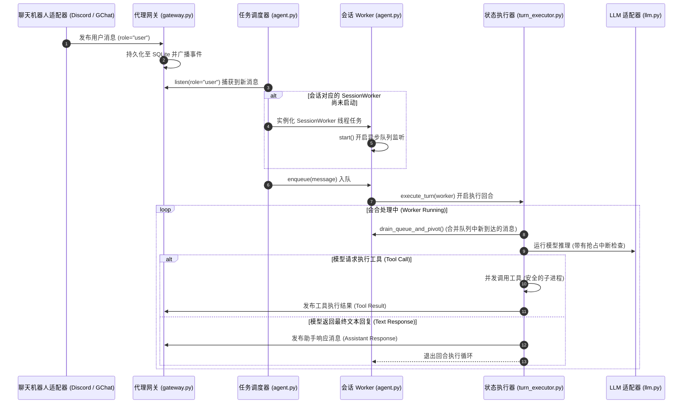

# 智能体生命周期环 (执行流程生命周期)

本技术文档详述了用户提示词事件如何在 Kesoku 的异步 Agent 调度器以及推理状态机循环中流动并被执行的完整生命周期。

---

## 🔄 生命周期流程图

以下展示了一条消息从用户最初输入到最终机器人完成回复的完整处理时序：



---

## ⚙️ 1. 消息接收与网关持久化

1.  **平台接收**：聊天机器人适配器收到外部平台事件（例如用户在 Discord 线程内发送文本，或 GCP Pub/Sub 拉取到的新事件）。
2.  **网关发布**：适配器解析出频道与会话映射，并调用网关发布接口：
    ```python
    await gateway.post(MessageDTO(role="user", content="...", session_id="...", ...))
    ```
3.  **持久化与广播**：网关（Gateway）将消息写入 SQLite 数据库的 `messages` 表，并立即向内存中的所有活跃监听器分发该消息事件。

---

## 2. 任务调度与路由 (`Agent`)

1.  **调度器主循环**：后台的主 `Agent` 调度进程持有一个长轮询监听器，实时检索状态为 PENDING 的新用户消息：
    ```python
    async for msg in self.gateway.listen(role=MessageRole.USER, status=MessageStatus.PENDING):
    ```
2.  **定位会话 Worker**：当收到新消息时，调度器检查其管理的 `self.workers` (`dict[str, SessionWorker]`) 映射表：
    *   如果发现该 `msg.session_id` 对应的 `SessionWorker` 不存在（或此前已关闭退出），调度器将实例化一个全新的 `SessionWorker` 任务，并调用 `worker.start()` 启动其后台协程。
3.  **消息入队**：调度器将新消息塞入对应 Worker 的内部异步消息队列中 (`worker.enqueue(msg)`)。

---

## 3. 会话回合异步处理 (`SessionWorker`)

1.  **Worker 协程监听**：`SessionWorker` 协程独立监听其消息队列 (`_worker_loop`)：
    ```python
    async def _worker_loop(self):
        while self.running:
            msg = await self.queue.get()
            # ... 解析活动角色设定 ...
            await self.executor.execute_turn(message=msg, worker=self)
            self.queue.task_done()
    ```
2.  **清空队列与合并（Draining and Pivoting）**：在执行回合 `execute_turn` 时，状态执行器（`TurnExecutor`）会首先排查队列中是否在极短时间内涌入了多条用户消息。若有，它会将它们一次性出队并合并为一个单一的 Prompt，供 Agent 处理。
3.  **智能体推理执行环**：
    *   **组装上下文**：执行器编译当前的系统提示词（依次装载角色 `intro.md` 人设、工作区目录 AWD、以及会话 Staging 目录等）。
    *   **LLM 推理**：执行器调用底层 LLM 驱动（`GeminiLLM` 或 `ClaudeLLM`），并为其注册 `is_interrupted` 回调函数（指向 `not worker.queue_empty()`）。如果用户在模型生成中途又发送了新消息，推理任务会被优雅地抢占并提前终止。
    *   **工具执行**：如果模型决定调用外部工具（例如运行 Shell 脚本），执行器会并发启动工具运行器。
        *   *安全机制*：工具执行具有原子性。一旦工具开始在宿主机上运行，系统不会在中途强制 Kill 进程，只有在两次执行步骤**之间**才会检查中断状态。
4.  **回合结束与休眠**：当 LLM 返回最终的文本响应（说明当前回合的任务已处理完毕）且消息队列为空时，Worker 协程进入休眠状态，等待调度器分发下一个新事件。
