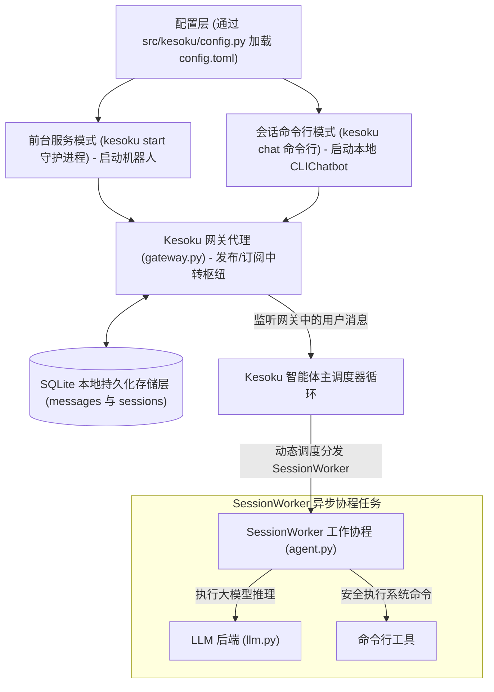

# 系统架构与并发设计

本技术文档详述了 Kesoku AI Agent 的核心系统架构设计、异步并发管理模型以及防卡死消息抢占中断逻辑。

---

## 🏛️ 架构设计全景图

Kesoku 围绕**解耦的网关代理（Broker Gateway）架构**进行组织，将前端消息收发与后端大模型推理任务完全解耦：

---

## ⚙️ 核心并发模型与防卡死抢占机制

为了保证多用户访问、长网络延时或耗时工具调用状态下，智能体能够提供流畅、安全的应答，Kesoku 设计了精密的并发管理方案：

### 1. 无状态 Pub/Sub 代理中转
网关通过 `post(message)` 进行数据持久化，同时通过 Python 的 `asyncio` 异步生成器将消息实时推送到活动的 `listen(**filters)` 监听通道中。这种解耦方式保证了各个机器人适配器可以只负责前端交互渲染，不用关心底层 Agent 推理的状态。

### 2. 独占式 SessionWorker 任务调度
当 Agent 主调度程序监听到新的用户消息时：

*   它会首先检查当前 `session_id` 是否拥有活动的 `SessionWorker` 任务。
*   如果没有，系统会即时实例化一个 Worker 协程，负责该会话在后台的串行回合迭代。
*   如果已有 Worker 协程正在运行，新消息会被直接塞入该 Worker 的内部异步队列中，等待下一步骤处理，防止产生多线程读写锁冲突。

### 3. 工具执行原子性与思维抢占中断策略
*   **工具调用不可强杀**：为了保证宿主机系统状态的一致性与安全性（例如 Agent 正在调用 Shell 工具修改代码或写入文件），所有的工具执行（Tool Execution）都被视为原子步骤。一旦工具开始运行，系统绝不会中途强杀进程，而是会在工具返回结果、重新回到推理状态机的关卡时，才会执行安全检查。
*   **思维抢占中断**：当大模型处于深度推理（Chain-of-Thought）或者正在等待下一次接口调用时，如果检测到 Worker 队列中涌入了新的用户 Prompt，系统会立即丢弃后续已排队的中间计划，中断当前 turns，将未完成的推理标记为 `interrupted`，并在新的一轮中优先响应用户的插话指令。

### 4. 基于Turn Root的时间轴重排序
为了完美恢复被中断的话题线，且防止异步并发执行的工具结果在持久化日志中产生时间轴交错，Kesoku 将会话消息记录按照联合排序索引 `(root_message_timestamp, message_timestamp)` 进行逻辑重排，确保每一次话题追溯的上下文都符合逻辑连贯性。
