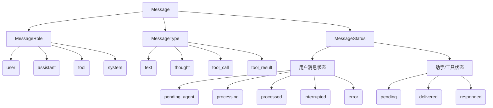

# 消息模型与生命周期规范

本技术文档提供了 `Message` 数据模型的完整规范，包含字段配置矩阵、系统全局生命周期状态机、会话历史保存机制、用户可见性行为以及端到端对话流执行轨迹的详细定义。

---

## 1. 核心架构概述

Kesoku 基于一个高度解耦的异步**纯代理总线架构（Pure Broker Architecture）**运行。该架构以 `Message` 数据库实体模型（定义于 `src/kesoku/db/models.py`）为中心，通过代理网关 `Gateway`（定义于 `src/kesoku/gateway/gateway.py`）将数据持久化写入本地 SQLite，并实时广播给内存中的各个订阅协程。

这套解耦机制使得第三方机器人平台适配器（CLI, Discord, Google Chat, WeChat 等）与后端的智能体推理工作协程之间，能够完全通过状态驱动的消息进行协同交互。

---

## 2. 消息属性矩阵 (核心三轴)

Kesoku 中的每条消息记录都围绕以下三个核心属性维度构建：**角色 (Role)**、**类型 (Type)** 和 **状态 (Status)**。



### 2.1 角色 (`role`)
定义了消息是由哪一类功能实体生成或主导的：

*   `user`：外部真实用户、后台定时任务触发器（Cronjob）或模拟调度事件。
*   `assistant`：Kesoku 智能体本身生成的回复（包括中间思维链、文本响应、通知消息等）。
*   `tool`：外设工具，包含工具调用请求或工具执行的返回值输出。
*   `system`：系统内部调度通知、异常跟踪提示等。

### 2.2 类型 (`type`)
定义了消息正文的结构化格式与运行语义：

*   `text`：常规文本，用于大模型消费或最终呈递给用户。
*   `thought`：大模型在发出工具调用指令**之前**输出的推理思维链（Chain-of-thought）。
*   `tool_call`：大模型发出的结构化工具调用请求，包含工具名称和执行参数。
*   `tool_result`：宿主机工具执行完毕后返回的标准输出流或报错异常栈。

### 2.3 状态 (`status`)
在流水线中实时追踪消息的流转阶段：

*   `pending_agent`：新接收的用户提问已写入数据库，等待 Agent 分发 Worker 接管。
*   `processing`：Worker 协程正在调度大模型对该用户消息进行推理处理。
*   `processed`：用户提问的回合推理已全部结束，并成功产生助手回复。
*   `interrupted`：推理被抢占终止（例如由于用户中途插话，导致当前回合及排队中的工具被废弃）。
*   `error`：在处理回合中遭遇无法挽回的崩溃或上下文解析错误。
*   `pending`：Agent 生成的出站文本回复已入队，等待对应的 Chatbot 适配器抓取发送。
*   `delivered`：消息已被适配器物理发送、打印或渲染至外部目标聊天平台上。
*   `responded`：内部消息（思维链、工具调用、工具结果）在后台已正确处理，不需再行投递。

---

## 3. 消息字段配置详解

下表记录了系统各模块根据消息源及目标，动态填充各字段的明细规范：

| 消息分类 | 语义说明 | `role` | `type` | `chatbot_id` | `channel_id` | `sender` | 初始 `status` | 终态 `status` | 用户可见性 | 大模型 (当前回合) | 大模型 (历史上下文) | `metadata` 附加内容 | 消息正文样例 |
| :--- | :--- | :--- | :--- | :--- | :--- | :--- | :--- | :--- | :--- | :--- | :--- | :--- | :--- |
| **标准用户提问** | 真实用户从聊天界面输入的文字或附件 | `user` | `text` | 当前聊天平台 (`"cli"`, `"discord"` 等) | 平台频道/线程 ID | 用户名或代号 | `pending_agent` | `processed` / `interrupted` / `error` | **可见** | **可见** (完整内容) | **可见** *(图片附件被剥离)* | `{"discord_message_id": str, "attachments": [...]}` | `"请帮我查询东京天气。"` |
| **定时任务消息** | 后台 Cronjob 触发器自动生成的 Prompt | `user` | `text` | 当前聊天平台 | 目标频道 ID | `"Cronjob"` | `pending_agent` | `processed` | **可见** | **可见** | **可见** | `{"is_cronjob": True}` | `"Run status diagnostics"` |
| **手动压缩提问** | 用户发送 `/compact` 时，系统生成的虚拟提问 | `user` | `text` | 平台 ID | 当前频道 ID | `"System"` | `pending_agent` | `processed` | **可见** | **可见** | **可见** | `{"is_compaction": True}` | `"[System Notification] The user manually requested compaction..."` |
| **智能体思维链** | Agent 内部生成的思维推理流 | `assistant` | `thought` | 平台 ID | 当前频道 ID | `"Kesoku"` | `responded` | `responded` *(UI版启动时为 `delivered`)* | **折叠可见 / CLI可见** *(微信静默过滤)* | **可见** | **剥离** *(已结束回合被滤除)* | `None` | `"我需要调用 run_shell_command 执行测试用例。"` |
| **智能体最终回复** | 呈现给用户的最终回复文本 | `assistant` | `text` | 平台 ID | 当前频道 ID | `"Kesoku"` | `pending` | `delivered` | **可见** | **可见** | **可见** | `{"turn_metrics": {...}}` | `"东京当前天气晴朗，温度24°C。"` |
| **工具调用指令** | 模型生成的结构化工具调用请求 | `tool` | `tool_call` | 平台 ID | 当前频道 ID | `"Kesoku"` | `responded` | `responded` *(UI版启动时为 `delivered`)* | **折叠可见 / CLI可见** *(微信静默过滤)* | **可见** | **可见** | `{"tool_name": str, "tool_arguments": dict}` | `"Calling tool run_shell_command with args: ..."` |
| **工具执行输出** | 宿主机工具返回的标准输出或错误异常 | `tool` | `tool_result` | 平台 ID | 当前频道 ID | 执行的工具名 | `responded` | `responded` *(UI版启动时为 `delivered`)* | **折叠可见 / CLI可见** *(微信静默过滤)* | **可见** | **可见** | `{"tool_name": str, "tool_result": str}` | `"[STDOUT] tests passed in 0.42s"` |
| **系统提示词** | 框架规则和设定引导 (Virtual 记录) | `system` | `text` | `"system"` | `"system"` | `"System"` | `responded` | `responded` | **仅在命令行/调试可见** | **作为 System Instruction 注入** | **作为 System Instruction 注入** | `None` | `"# System Instructions\nYou are Kesoku..."` |
| **后台唤醒警报** | 后台工具命令执行完成后，系统自动生成的唤醒消息 | `system` | `text` | 平台 ID | 当前频道 ID | `"System"` | `pending_agent` | `processed` | **不可见** *(后台静默唤醒)* | **可见** *(转译为 USER 回合)* | **可见** *(转译为 USER 回合)* | `None` | `"[System Alert] Background Job job_123 finished..."` |
| **模型防空催化剂** | LLM 异常返回空响应时注入的自愈消息 | `system` | `text` | 平台 ID | 当前频道 ID | `"System"` | `responded` | `responded` | **不可见** *(后台静默自愈)* | **可见** *(转译为 USER 回合)* | **可见** *(转译为 USER 回合)* | `None` | `"Your previous response had empty content..."` |
| **轻量系统通知** | 界面弹出的轻量提示（如自动压缩完成等） | `assistant` | `text` | 平台 ID | 当前频道 ID | `"Notification"` | `pending` | `delivered` | **可见** | **过滤** | **过滤** | `None` | `"🔄 聊天历史已自动压缩。"` |
| **崩溃报错通知** | 系统异常终止时呈递给用户的中文报错 | `assistant` | `text` | 平台 ID | 当前频道 ID | `"Kesoku"` | `pending` | `delivered` | **可见** | **可见** | **可见** | `None` | `"⚠️ 处理您的请求时发生异常: ..."` |

---

## 4. 核心状态流转与生命周期

```
                       [用户消息 / Cron 触发 / 自动压缩触发]
                                         │
                                         ▼
                               (status: pending_agent)
                                         │
                                         ▼  [Worker 线程认领回合]
                                (status: processing)
                                         │
        ┌───────────────────────────────┼───────────────────────────────┐
        ▼ (中间状态：思维链/工具执行)     ▼ (抢占式强行中断)              ▼ (正常推理结束)
     (status: responded)              (status: interrupted)            (status: processed)
        │                                                               │
        ▼ [Chatbot 渲染中间状态]                                        ▼ [推送最终回复]
     (status: delivered)                                              (status: pending)
                                                                        │
                                                                        ▼ [Chatbot 发送出站完毕]
                                                                     (status: delivered)
```

### 4.1 用户输入消息生命周期
1.  **接收**：Chatbot 适配器抓取用户输入，解密并将媒体图片下载到 Staging 工作目录，实例化 `Message` 模型并将状态标记为 `pending_agent` 写入数据库。
2.  **处理**：调度器监听检测到 `pending_agent`。在分配给 SessionWorker 后，通过 CAS 操作更新数据库中对应的用户消息状态为 `processing`，并开始执行推理回合。
3.  **结果**：
    *   **正常结束**：模型推理完成并发送最终文本，用户提问状态变更为 `processed`。
    *   **强行中断**：新提问在推理过程中到达，Worker 任务被 Cancel，处理中的提问状态以及未回复的 tool 状态均更新为 `interrupted`。
    *   **执行异常**：回合遭遇致命崩溃，更新状态为 `error`。

### 4.2 智能体出站回复生命周期
1.  **生成**：Worker 完成计算，向网关发布最终文本，状态设置为 `pending`。
2.  **发送**：Chatbot 适配器检测到 `pending`，对正文切分并调用平台 API 发送，完毕后将数据库中的状态更新为 `delivered`。
3.  **收尾**：Chatbot 激活 `on_message_delivered` 钩子，消除输入状态，计算响应时间。

### 4.3 中间步骤消息生命周期 (思维/工具)
1.  **生成**：智能体进行 Thought 或发起 Tool Call 时，向网关发布状态为 `responded` 的消息。
2.  **渲染**：
    *   **可视化终端 (Discord, Google Chat)**：适配器捕获 `responded` 消息并在聊天室中 live-render 思维过程或工具状态条（如带有 ⏳ 状态），更新状态为 `delivered` 防止二次重复发送。当收到对应的 `tool_result` 时，适配器在原地将状态编辑为 ✅ 或 ❌ 标志。
    *   **无状态终端 (WeChat)**：微信适配器不支持原地编辑，所以在收到这类消息时，会在后台静默将其标记为 `delivered`，但不投递到微信群里。
    *   **CLI**：立即使用 Panels 将思维（青色）、工具调用（黄色）、工具输出（品红色）打印到控制台，并标记为 `delivered`。

### 4.4 僵死/卡死消息自愈自恢复
*   **Worker 重启恢复**：如果系统意外崩溃或重启，处于 `processing` 状态的消息将无限期卡死。网关在启动时运行 `recover_orphaned_processing_messages()`，排查所有创建时间超过 300 秒且状态依然为 `processing` 的用户消息，并将其强制重置回 `pending_agent` 重新排队处理。
*   **工具悬空恢复**：系统在生成历史时，会检查是否有 `tool_call` 缺失对应的 `tool_result` 回应（表示工具运行中途遭遇断电或重启）。若存在，系统会在内存中自动补齐一条合成的中断报错 Message，防止 LLM 读取历史时发生上下文逻辑断层。

---

## 5. 会话历史保存与模型输入剥离规范

为了平衡用户审计的透明度与大模型的上下文 token 限制，Kesoku 对数据库历史和 LLM 实际读取历史进行了分流设计。

### 5.1 数据库持久化历史 (`get_session_history`)
*   **完整保存**：数据库保留每一次对话的全部消息，包括被隐藏的思维流和工具调用栈。
*   **多阶段排序算法 (Phased Sorting)**：因为异步工具运行会产生时间戳重叠，数据库查询时采用多阶段排序，将每个 Turn 内的消息按生命周期先后归位：Thought (阶段 0) -> Tool Call (阶段 1) -> Tool Result (阶段 2) -> Final Text (阶段 3)。

### 5.2 大模型实际 Prompt 历史 (`build_clean_history`)
在将历史输入给大模型时，会运行优化裁剪链：

*   **系统排除**：剔除所有轻量的系统级临时通知（如 `sender="Notification"` 的提示语）。
*   **剥离思维链 (Thought Stripping)**：**所有历史回合中的 assistant thoughts (`type=thought`) 都会被彻底清除**，只保留当前最活跃一轮的思维以指导当下行动。这极大地节约了 Token 空间，并避免模型受到历史垃圾思维的干扰。
*   **剥离附件 (Attachment Stripping)**：从历史 user 消息的元数据中剥离庞大的文件字节或图片，并在正文末尾加上占位符（例如 `[Attachments stripped from history: data.csv]`），让模型知道文件存在，但不重复载入数据。
*   **保留工具流**：完整的工具调用和输出会被保留，让模型对已经执行过的系统操作保持清晰认知。

### 5.3 用户通道可见性矩阵

| 消息类型 | 命令行 (CLI) | Discord | Google Chat | 微信 (WeChat) |
| :--- | :--- | :--- | :--- | :--- |
| **用户提问** | 可见 | 可见 | 可见 | 可见 |
| **智能体最终文本/文件** | 可见 (Rich 渲染) | 可见 (直接回复) | 可见 (卡片排版) | 可见 (常规分块文本) |
| **智能体思维链** | 可见 (青色面板) | 可见 (Live 状态条) | 可见 (折叠中间卡片) | **隐藏** (后台静默) |
| **工具调用** | 可见 (黄色面板) | 可见 (Live 状态条) | 可见 (折叠中间卡片) | **隐藏** (后台静默) |
| **工具执行输出** | 可见 (品红面板) | 可见 (状态 emoji 变更) | 可见 (状态 emoji 变更) | **隐藏** (后台静默) |
| **系统交互日志** | 可见 (终端输出) | 可见 (Live 状态条) | 可见 (折叠中间卡片) | **隐藏** (后台静默) |

### 5.4 高级角色映射规则 (Transpilation)
为了规避主流聊天大模型接口（如 Gemini API、OpenAI API）所强制要求的 alternating roles 角色交替验证规则，适配器在生成 IR 结构时（`history_to_turns` 方法）会执行逻辑转译：

*   **自愈消息 (Nudge)**：原本在数据库中为 `role=system`，转译器会将其转译为 `role=user` 并前置提示语 `[System Notification]\n`，使得模型可以正常接收自愈警报，且不触犯厂商交替校验规则。
*   **定时任务 / 后台警报**：一律在转译层包装为标准的 `user` 或 `tool_result` 回合提交，在用户侧完全不可见，但大模型可流畅解读。

---

## 6. 端到端执行轨迹示例

以下展示了三种典型回合场景下，数据库 `Message` 记录的完整序列痕迹。

### 示例 6.1：带有工具调用的常规对话回合 (Discord)

用户提问：`"运行 agent 历史模块的单元测试"`。

1.  **用户消息写入** (`pending_agent`)：
    ```json
    [
      {
        "id": "msg_user_001",
        "session_id": "sess_agent_history",
        "chatbot_id": "discord",
        "channel_id": "1234567890123",
        "sender": "Chii",
        "role": "user",
        "type": "text",
        "content": "`Chii` <@112233> at `2026-05-27 20:50:00 SGT`:\n运行 agent 历史模块的单元测试",
        "status": "pending_agent"
      }
    ]
    ```
    *(Worker 认领该消息，`msg_user_001` 的状态转换为 `processing`)*

2.  **智能体进行思考并下达工具执行请求** (`responded`)：
    ```json
    [
      {
        "id": "msg_thought_001",
        "session_id": "sess_agent_history",
        "parent_id": "msg_user_001",
        "chatbot_id": "discord",
        "channel_id": "1234567890123",
        "sender": "Kesoku",
        "role": "assistant",
        "type": "thought",
        "content": "我需要使用 uv pytest 来运行 history 模块的单元测试，我应该直接执行 run_shell_command 工具。",
        "status": "responded"
      },
      {
        "id": "msg_call_001",
        "session_id": "sess_agent_history",
        "parent_id": "msg_user_001",
        "chatbot_id": "discord",
        "channel_id": "1234567890123",
        "sender": "Kesoku",
        "role": "tool",
        "type": "tool_call",
        "content": "Calling tool `run_shell_command` with arguments:\n```json\n{\n  \"command\": \"uv run pytest tests/test_history.py\"\n}\n```",
        "status": "responded",
        "metadata": {
          "tool_name": "run_shell_command",
          "tool_arguments": {
            "command": "uv run pytest tests/test_history.py"
          }
        }
      }
    ]
    ```
    *(Discord 机器人获取这两条消息，在界面上输出 💭 思考和 🛠️ 执行提示，并更新它们在数据库中的状态为 `delivered`)*

3.  **工具执行完毕返回结果** (`responded`)：
    ```json
    [
      {
        "id": "msg_result_001",
        "session_id": "sess_agent_history",
        "parent_id": "msg_call_001",
        "chatbot_id": "discord",
        "channel_id": "1234567890123",
        "sender": "run_shell_command",
        "role": "tool",
        "type": "tool_result",
        "content": "=== STDOUT ===\n============================= test session starts =============================\ncollected 5 items\n\ntests/test_history.py .....                                              [100%]\n============================== 5 passed in 0.42s ===============================\n=== STDERR ===\n",
        "status": "responded",
        "metadata": {
          "tool_name": "run_shell_command",
          "tool_result": "5 passed in 0.42s"
        }
      }
    ]
    ```
    *(Discord 机器人在界面上将 ⏳ 状态图标原地编辑修改为 ✅，并将 `msg_result_001` 的数据库状态更改为 `delivered`)*

4.  **智能体输出最终答复** (`pending`)：
    ```json
    [
      {
        "id": "msg_reply_001",
        "session_id": "sess_agent_history",
        "parent_id": "msg_user_001",
        "chatbot_id": "discord",
        "channel_id": "1234567890123",
        "sender": "Kesoku",
        "role": "assistant",
        "type": "text",
        "content": "我已经成功运行了 history 模块的单元测试，全部 5 个测试用例均已顺利通过（耗时 0.42 秒）。",
        "status": "pending",
        "metadata": {
          "turn_metrics": {
            "session_turns": 3,
            "context_tokens": 8421,
            "turn_tool_calls": 1,
            "turn_tokens": 1042,
            "turn_time": 2.1
          }
        }
      }
    ]
    ```
    *(Discord 机器人投递文本，在消息卡片头部标注性能指标，注销输入状态，并将该回复的状态更新为 `delivered`。同时，提问消息 `msg_user_001` 归档为 `processed`)*
